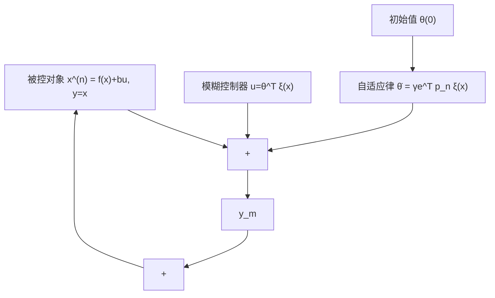

$$\dot {\boldsymbol {\theta}} = \gamma \boldsymbol {e} ^ {\mathrm{T}} \boldsymbol {p} _ {n} \boldsymbol {\xi} (\boldsymbol {x}) \tag {5.64}$$

则

$$\dot {V} = - \frac {1}{2} e ^ {\mathrm{T}} Q e - e ^ {\mathrm{T}} p _ {n} b \omega \tag {5.65}$$

当 $Q$ 足够大，且逼近误差 $\omega$ 很小时，可保证 $\dot{V} \leqslant 0$ 。

当 $\dot{V} \equiv 0$ 时, $e \equiv 0$ , 根据 LaSalle 不变性原理[35], 闭环系统为渐近稳定, 即当 $t \to \infty$ 时, $e \to 0$ , 系统的收敛速度取决于 $Q$ 。由于 $V \geqslant 0$ , $\dot{V} \leqslant 0$ , 则当 $t \to \infty$ 时, $V$ 有界, 从而 $\tilde{\theta}$ 有界。

直接自适应模糊控制系统的结构如图 5-18 所示。

flowchart

图5-18 直接自适应模糊控制系统
