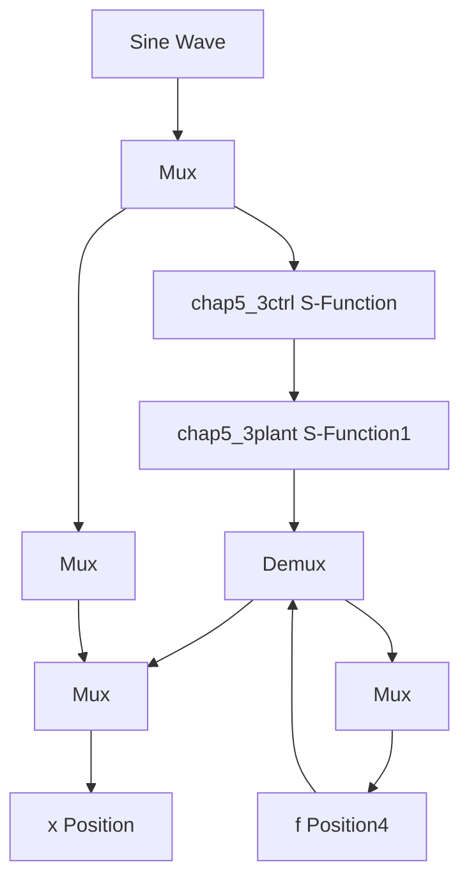

# 简单自适应模糊控制仿真程序

(1) 隶属函数设计: chap5\_3mf. m  
```matlab
clear all;
close all;

L1 = -pi/3;
L2 = pi/3;
L = L2 - L1;

T = L* 1/1000;

x = L1:T:L2;
figure(1);
for i = 1:1:5
    gs = -[(x + pi/3 - (i - 1)* pi/6)/(pi/12)].^2;
    u = exp(gs);
    hold on;
    plot(x,u);
end

xlabel('x');ylabel('Membership function degree'); 
```

(2) Simulink 主程序: chap5\_3sim. mdl


<details>
<summary>flowchart</summary>


</details>


(3) 被控对象 S 函数: chap5\_3plant.m

```matlab
function [sys,x0,str,ts] = s_function(t,x,u,flag)
switch flag,
case 0,
    [sys,x0,str,ts] = mdlInitializeSizes;
case 1,
    sys = mdlDerivatives(t,x,u);
case 3,
    sys = mdlOutputs(t,x,u);
case {2,4,9}
    sys = [];
otherwise
    error(['Unhandled flag = ',num2str(flag)]);
end
function [sys,x0,str,ts] = mdlInitializeSizes
sizes = simsizes;
sizes.NumContStates = 2;
sizes.NumDiscStates = 0;
sizes.NumOutputs = 3;
sizes.NumInputs = 2;
sizes.DirFeedthrough = 0;
sizes.NumSampleTimes = 0;
sys = simsizes(sizes);
x0 = [0.15;0];
str = [];
ts = [];
function sys = mdlDerivatives(t,x,u)
ut = u(1);

f = 3*(x(1) + x(2));
sys(1) = x(2);
sys(2) = f + ut;
function sys = mdlOutputs(t,x,u) 
```

$f = 3^{*}(x(1) + x(2))$ ;

```javascript
sys(1) = x(1); 
```

```javascript
sys(2) = x(2); 
```

```txt
sys(3) = f; 
```

(4) 控制器 S 函数: chap5\_3ctrl.m  
```matlab
function [sys,x0,str,ts] = spacemodel(t,x,u,flag)
switch flag,
case 0,
    [sys,x0,str,ts] = mdlInitializeSizes;
case 1,
    sys = mdlDerivatives(t,x,u);
case 3,
    sys = mdlOutputs(t,x,u);
case {2,4,9}
    sys = [];
otherwise
    error(['Unhandled flag = ',num2str(flag)]);
end
function [sys,x0,str,ts] = mdlInitializeSizes
sizes = simsizes;
sizes.NumContStates = 25;
sizes.NumDiscStates = 0;
sizes.NumOutputs = 2;
sizes.NumInputs = 4;
sizes.DirFeedthrough = 1;
sizes.NumSampleTimes = 1;
sys = simsizes(sizes);
x0 = [0.1* ones(25,1)];
str = [];
ts = [0 0];
function sys = mdlDerivatives(t,x,u)
xd = sin(t);
dxd = cos(t);

x1 = u(2);
x2 = u(3);
e = x1 - xd;
de = x2 - dxd;
c = 15;
s = c* e + de;

xi = [x1;x2];
