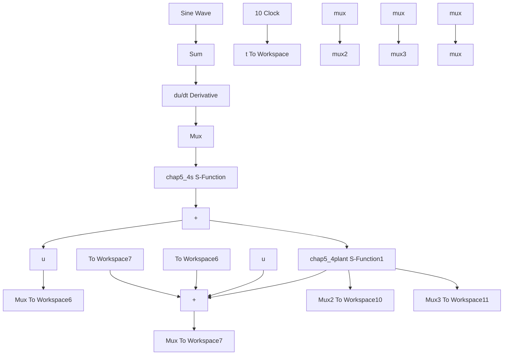

# 间接模糊自适应控制仿真程序

(1) 隶属函数设计程序: chap5\_4mf.m  
```matlab
clear all;
close all;

L1 = -pi/6;
L2 = pi/6;
L = L2 - L1;

T = L* 1/1000;

x = L1 : T : L2;
figure(1);
for i = 1 : 1 : 5
    gs = -[(x + pi/6 - (i - 1) * pi/12)/(pi/24)]^2;
    u = exp(gs);
    hold on;
    plot(x, u);
end

xlabel('x');ylabel('Membership function degree'); 
```

(2) Simulink 主程序: chap5\_4sim.mdl  


<details>
<summary>flowchart</summary>


</details>

(3) 控制器 S 函数: chap5\_4s. m

function[sys,x0,str,ts] = spacemodel(t,x,u,flag)   
```matlab
switch flag,
case 0,
    [sys,x0,str,ts] = mdlInitializeSizes;
case 1,
    sys = mdlDerivatives(t,x,u);
case 3,
    sys = mdlOutputs(t,x,u);
case {2,4,9}
    sys = [];
otherwise
    error(['Unhandled flag = ',num2str(flag)]);
end

function[sys,x0,str,ts] = mdlInitializeSizes
sizes = simsizes;
sizes.NumContStates = 50;
sizes.NumDiscStates = 0;
sizes.NumOutputs = 3;
sizes.NumInputs = 2;
sizes.DirFeedthrough = 1;
sizes.NumSampleTimes = 0;
sys = simsizes(sizes);
x0 = [0.1* ones(50,1)];
str = [];
ts = [];
function sys = mdlDerivatives(t,x,u)
gama1 = 50;
gama2 = 1; 
```

```matlab
r = 0.1* sin(t);
dr = 0.1* cos(t);
ddr = -0.1* sin(t);

e = u(1);
de = u(2);
x1 = r - e;
x2 = dr - de;

k1 = 2;
k2 = 1;
k = [k2;k1];
E = [e,de]';
for i = 1:1:25
    thtaf(i,1) = x(i);
end
for i = 1:1:25
    thtag(i,1) = x(i+25);
end
% % % % % % % % % % % % % % % % % % % % % % % % A = [0 - k2;
    1 - k1];
Q = [10 0;0 10];
P = lyap(A,Q);
% % % % % % % % % % % % % % % % % % % % % % % % % FS1 = 0;
for l1 = 1:1:5
    gs1 = -[(x1 + pi/6 - (l1 - 1)* pi/12)/(pi/24)]^2;
    u1(l1) = exp(gs1);
end
for l2 = 1:1:5
    gs2 = -[(x2 + pi/6 - (l2 - 1)* pi/12)/(pi/24)]^2;
    u2(l2) = exp(gs2);
end
for l1 = 1:1:5
    for l2 = 1:1:5
    FS2(5*(l1 - 1) + l2) = u1(l1)* u2(l2);
    FS1 = FS1 + u1(l1)* u2(l2);
    end
end
FS = FS2/(FS1 + 0.001);

fx1 = thtaf'* FS';
gx1 = thtag'* FS' + 0.001;

ut = 1/gx1* (-fx1 + ddr + k'* E); 
```

```matlab
b = [0;1];
S1 = -gama1* E'* P* b* FS;
S2 = -gama2* E'* P* b* FS* ut;

for i = 1:1:25
    sys(i) = S1(i);
end
