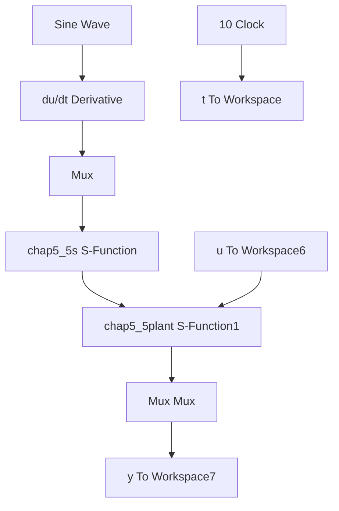

# 直接自适应模糊控制仿真程序

(1) 隶属函数设计程序: chap5\_5mf.m  
```matlab
clear all;
close all;
L1 = -3;
L2 = 3;
L = L2 - L1; 
```

```matlab
T = 0.001;
x = L1 : T : L2;
figure(1);
for i = 1 : 1 : 6
    if i == 1
    u = 1. / (1 + exp(5* (x + 2)));
    elseif i == 6
    u = 1. / (1 + exp(-5* (x - 2)));
    else
    u = exp(-(x + 2.5 - (i - 1)).^2);
end
    hold on;
    plot(x, u);
end
xlabel('x');ylabel('Membership function degree'); 
```

(2) Simulink 主程序: chap5\_5sim.mdl


<details>
<summary>flowchart</summary>


</details>

(3) 控制器 S 函数: chap5\_5s.m

```javascript
function[sys,x0,str,ts] = spacemodel(t,x,u,flag) 
```

```matlab
switch flag,
case 0,
    [sys,x0,str,ts] = mdlInitializeSizes;
case 1,
    sys = mdlDerivatives(t,x,u);
case 3,
    sys = mdlOutputs(t,x,u);
case {2,4,9}
    sys = [];
otherwise
    error(['Unhandled flag = ',num2str(flag)]);
end

function[sys,x0,str,ts] = mdlInitializeSizes 
```

```matlab
sizes = simsizes;
sizes.NumContStates = 36;
sizes.NumDiscStates = 0;
sizes.NumOutputs = 1;
sizes.NumInputs = 4;
sizes.DirFeedthrough = 1;
sizes.NumSampleTimes = 0;
sys = simsizes(sizes);
x0 = [zeros(36,1)];
str = [];
ts = [];
function sys = mdlDerivatives(t,x,u)

r = u(1);
dr = u(2);
xi(1) = u(3);
xi(2) = u(4);

e = r - x(1);
de = dr - x(2);

gama = 50;

k2 = 1;
k1 = 10;
E = [e,de]';
A = [0 - k2;
    1 - k1];
Q = [50 0;0 50];
P = lyap(A,Q);
% % % % % % % % % % % % % % % % % % % % % % % % % % % % %
FS1 = 0;

u1(1) = 1/(1 + exp(5* (xi(1) + 2)));
u1(6) = 1/(1 + exp(-5* (xi(1) - 2)));
for i = 2 : 1 : 5
    u1(i) = exp(-(xi(1) + 1.5 - (i - 2))^2);
end

u2(1) = 1/(1 + exp(5* (xi(2) + 2)));
u2(6) = 1/(1 + exp(-5* (xi(2) - 2)));
for i = 2 : 1 : 5
    u2(i) = exp(-(xi(2) + 1.5 - (i - 2))^2);
end

for i = 1 : 1 : 6
    for j = 1 : 1 : 6
    FS2(6* (i - 1) + j) = u1(i)* u2(j);
    FS1 = FS1 + u1(i)* u2(j);
    end
end 
```

```matlab
FS = FS2/FS1;
b = [0;1];
S = gama* E'* P(:,2)* FS;
for i = 1:1:36
    sys(i) = S(i);
end

function sys = mdlOutputs(t,x,u)

r = u(1);
dr = u(2);
xi(1) = u(3);
xi(2) = u(4);

for i = 1:1:36
    thtau(i,1) = x(i);
end

FS1 = 0;
u1(1) = 1/(1 + exp(5*(xi(1)+2)));
u1(6) = 1/(1 + exp(-5*(xi(1)-2)));
for i = 2:1:5
    u1(i) = exp(-(xi(1)+1.5-(i-2))^2);
end
