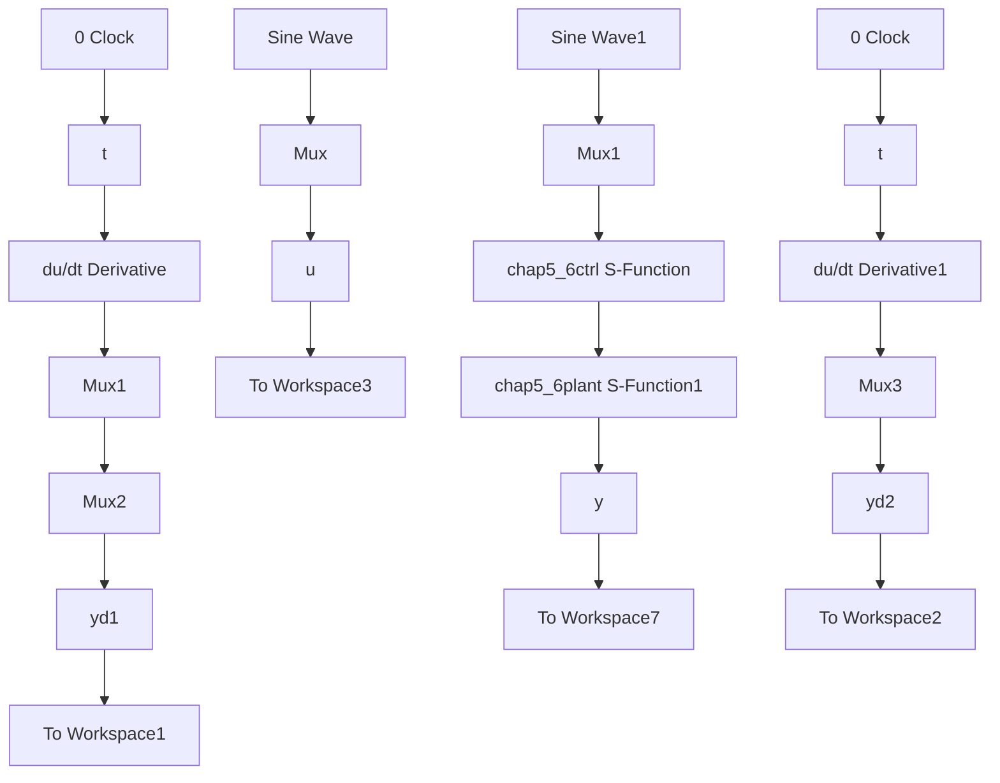

# 基于摩擦模糊补偿的机械手控制仿真程序

(1) Simulink 主程序: chap5\_6sim.mdl


<details>
<summary>flowchart</summary>


</details>

(2) 控制器 S 函数: chap5\_6ctrl.m

```matlab
function [sys,x0,str,ts] = MIMO_Tong_s(t,x,u,flag)
switch flag,
case 0,
    [sys,x0,str,ts] = mdlInitializeSizes;
case 1,
    sys = mdlDerivatives(t,x,u);
case 3,
    sys = mdlOutputs(t,x,u);
case {2,4,9}
    sys = [];
otherwise
    error(['Unhandled flag = ',num2str(flag)]);
end
function [sys,x0,str,ts] = mdlInitializeSizes
global nmn1 nmn2 Fai
nmn1 = 10;nmn2 = 10;
Fai = [nmn1 0;0 nmn2];
sizes = simsizes;
sizes.NumContStates = 10;
sizes.NumDiscStates = 0;
sizes.NumOutputs = 4;
sizes.NumInputs = 8;
sizes.DirFeedthrough = 1;
sizes.NumSampleTimes = 0;
sys = simsizes(sizes);
x0 = [0.1* ones(10,1)];
str = [];
ts = [];
function sys = mdlDerivatives(t,x,u) 
```

```matlab
global nmn1 nmn2 Fai
qd1 = u(1);
qd2 = u(2);
dqd1 = 0.3* cos(t);
dqd2 = 0.3* cos(t);
dqd = [dqd1 dqd2]';
ddqd1 = -0.3* sin(t);
ddqd2 = -0.3* sin(t);
ddqd = [ddqd1 ddqd2]';
q1 = u(3); dq1 = u(4);
q2 = u(5); dq2 = u(6);
fsd1 = 0;
for l1 = 1:1:5
    gs1 = -[(dq1 + pi/6 - (l1 - 1) * pi/12) / (pi/24)]^2;
    u1(l1) = exp(gs1);
end
fsd2 = 0;
for l2 = 1:1:5
    gs2 = -[(dq2 + pi/6 - (l2 - 1) * pi/12) / (pi/24)]^2;
    u2(l2) = exp(gs2);
end
for l1 = 1:1:5
    fsu1(l1) = u1(l1);
    fsd1 = fsd1 + u1(l1);
end
for l2 = 1:1:5
    fsu2(l2) = u2(l2);
    fsd2 = fsd2 + u2(l2);
end
fs1 = fsu1/(fsd1 + 0.001);
fs2 = fsu2/(fsd2 + 0.001);
e1 = q1 - qd1;
e2 = q2 - qd2;
e = [e1 e2]';
de1 = dq1 - dqd1;
de2 = dq2 - dqd2;
de = [de1 de2]';
s = de + Fai* e;
Gama1 = 0.0001; Gama2 = 0.0001;

S1 = -1/Gama1*s(1)*fs1;
S2 = -1/Gama2*s(2)*fs2;
for i = 1:1:5
    sys(i) = S1(i);
end
for j = 6:1:10 
```

```matlab
sys(j) = S2(j - 5);
end

function sys = mdlOutputs(t, x, u)
global nmn1 nmn2 Fai
q1 = u(3); dq1 = u(4);
q2 = u(5); dq2 = u(6);

r1 = 1; r2 = 0.8;
m1 = 1; m2 = 1.5;
