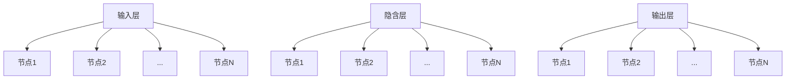
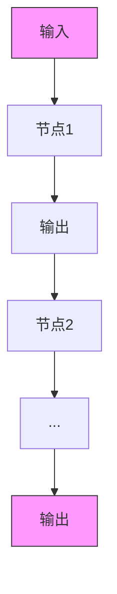

# 2. 反馈网络

网络结构如图 6-3 所示,该网络结构在输出层到输入层存在反馈,即每一个输入节点都有可能接受来自外部的输入和来自输出神经元的反馈。这种神经网络是一种反馈动力学系统,它需要工作一段时间才能达到稳定。Hopfield 神经网络是反馈网络中最简单且应用最广泛的模型,它具有联想记忆的功能,如果将 Lyapunov 函数定义为寻优函数,Hopfield 神经网络还可以解决寻优问题。

flowchart

图 6-2 前向型神经网络

flowchart

图 6-3 反馈型神经网络
