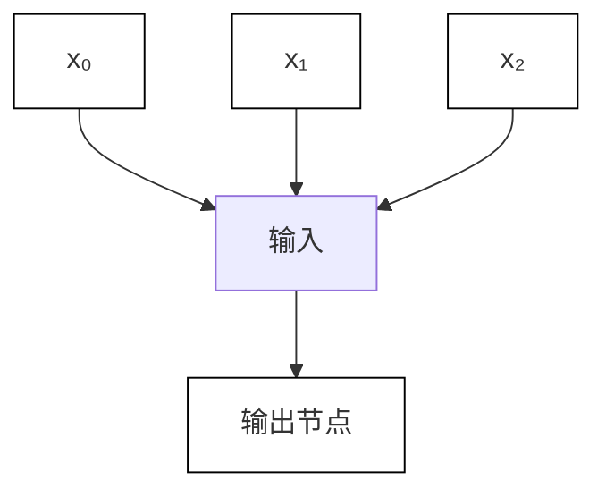

# 3. 自组织网络

网络结构如图 6-4 所示。Kohonen 网络是最典型的自组织网络。Kohonen 认为，当神经网络在接受外界输入时，网络将会分成不同的区域，不同区域具有不同的响应特征，即不同的神经元以最佳方式响应不同性质的信号激励，从而形成一种拓扑意义上的特征图，该图实际上是一种非线性映射。这种映射是通过无监督的自适应过程完成的，所以也称为自组织特征图。

flowchart

图6-4 自组织神经网络

Kohonen 网络通过无导师的学习方式进行权值的学习,稳定后的网络输出就对输入模式生成自然的特征映射,从而达到自动聚类的目的。
