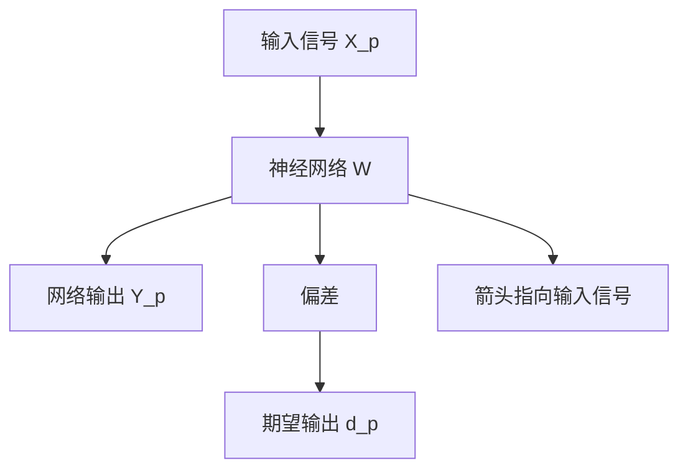
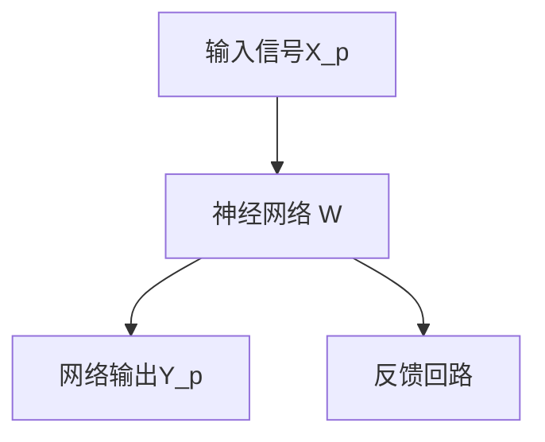

# 6.4 神经网络学习算法

神经网络学习算法是神经网络智能特性的重要标志,神经网络通过学习算法,实现了自适应、自组织和自学习的能力。

目前神经网络的学习算法有多种,按有无导师分类,可分为有导师学习(Supervised Learning)、无导师学习(Unsupervised Learning)和再励学习(Reinforcement Learning)等几大类。在有导师的学习方式中,网络的输出和期望的输出(即导师信号)进行比较,然后根据两者之间的差异调整网络的权值,最终使差异变小,如图6-5所示。在无导师的学习方式中,输入模式进入网络后,网络按照一种预先设定的规则(如竞争规则)自动调整权值,使网络最终具有模式分类等功能,如图6-6所示。再励学习是介于上述两者之间的一种学习方式。

flowchart

图6-5 有导师指导的神经网络学习

flowchart

图 6-6 无导师指导的神经网络学习

下面介绍两个基本的神经网络学习算法。
