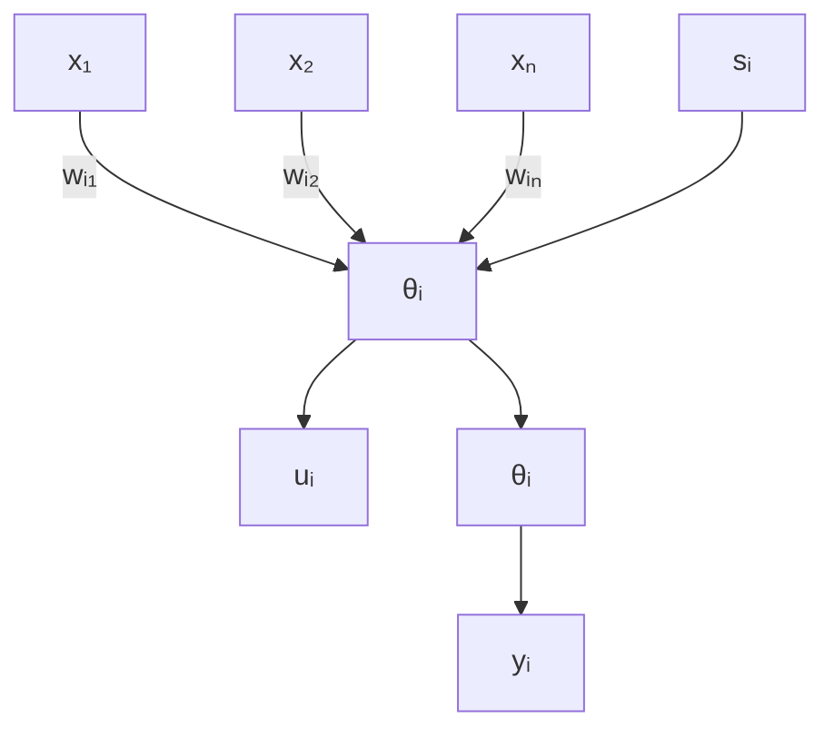

# 7.1 单神经元网络

图 7-1 中 $u_{i}$ 为神经元的内部状态, $\theta_{i}$ 为阈值, $x_{j}$ 为输入信号, $j = 1, \cdots, n$ , $w_{ij}$ 表示从单元 $u_{j}$ 到单元 $u_{i}$ 的连接权系数, $s_{i}$ 为外部输入信号。图 7-1 所示的模型可描述为

$$\mathrm{net} _ {i} = \sum_ {j} w _ {i j} x _ {j} + s _ {j} - \theta_ {i} \tag {7.1}u _ {i} = f \left(\text {net} _ {i}\right) \tag {7.2}y _ {i} = g \left(u _ {i}\right) = h \left(\mathrm{net} _ {i}\right) \tag {7.3}$$

通常情况下，取 $g(u_{i}) = u_{i}$ ，即 $y_{i} = f(\mathrm{net}_{i})$ 。

flowchart

图 7-1 神经元结构模型

常用的神经元非线性特性有以下 3 种。
