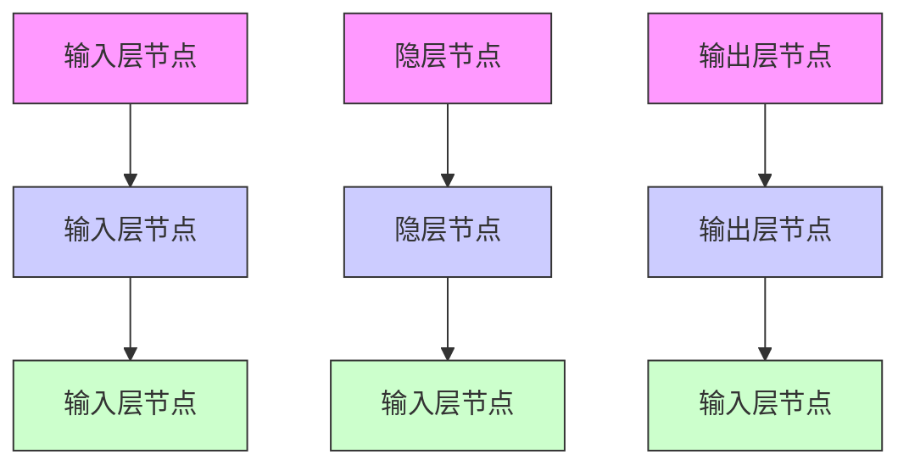

# 7.2.2 BP网络结构

含一个隐层的 BP 网络结构如图 7-5 所示, 图中, i 为输入层, j 为隐层, o 为输出层。

flowchart

```mermaid
graph TD
    A["输入层节点"] --> B["输入层节点"]
    C["隐层节点"] --> D["隐层节点"]
    E["输出层节点"] --> F["输出层节点"]
    B --> G["输入层节点"]
    D --> H["输入层节点"]
    F --> I["输入层节点"]
    style A fill:#f9f,stroke:#333
    style C fill:#f9f,stroke:#333
    style E fill:#f9f,stroke:#333
    style B fill:#ccf,stroke:#333
    style D fill:#ccf,stroke:#333
    style F fill:#ccf,stroke:#333
    style G fill:#cfc,stroke:#333
    style H fill:#cfc,stroke:#333
    style I fill:#cfc,stroke:#333
```

图 7-5 BP 神经网络结构
