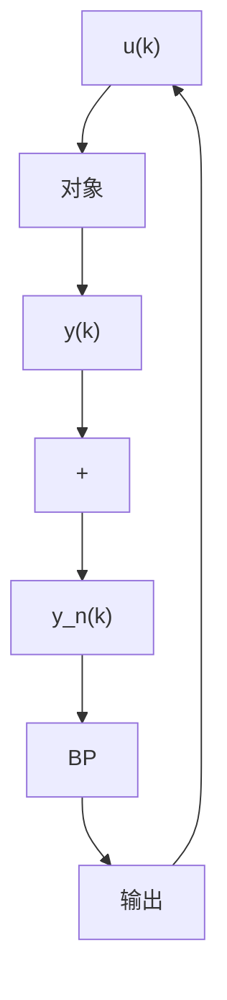
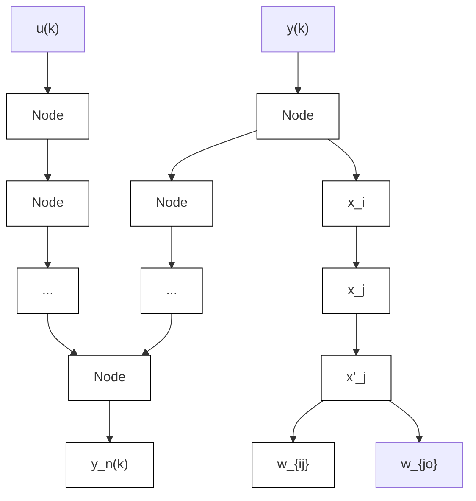

# 7.2.3 BP网络的逼近

BP 网络逼近的结构如图 7-6 所示, 图中 k 为网络的迭代步骤, $u(k)$ 和 $y(k)$ 为逼近器的输入。BP 为网络逼近器, $y(k)$ 为被控对象的实际输出, $y_{n}(k)$ 为 BP 网络的输出。将系统输出 $y(k)$ 及输入 $u(k)$ 的值作为逼近器 BP 的输入, 将系统输出与网络输出的误差作为逼近器的调整信号。

用于逼近的 BP 网络如图 7-7 所示。

flowchart

图 7-6 BP 神经网络逼近

flowchart

图 7-7 用于逼近的 BP 网络

BP算法的学习过程由正向传播和反向传播组成。在正向传播过程中，输入信息从输入层经隐层逐层处理，并传向输出层，每层神经元（节点）的状态只影响下一层神经元的状态。如果在输出层不能得到期望的输出，则转至反向传播，将误差信号（理想输出与实际输出之差）按连接通路反向计算，由梯度下降法调整各层神经元的权值，使误差信号减小。
