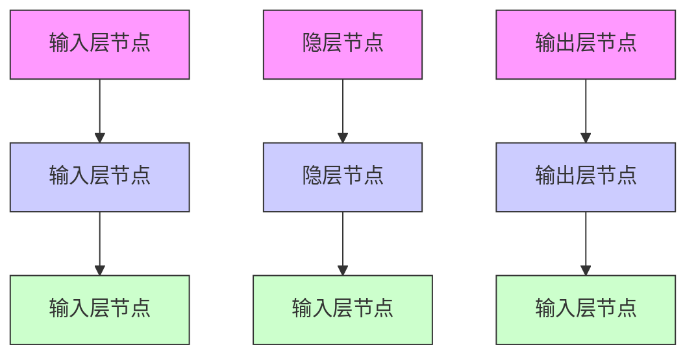

# 7.2.6 BP网络模式识别

由于神经网络具有自学习、自组织和并行处理等特征，并具有很强的容错能力和联想能力，因此，神经网络具有模式识别的能力。

在神经网络模式识别中,根据标准的输入输出模式对,采用神经网络学习算法,以标准的模式作为学习样本进行训练,通过学习调整神经网络的连接权值。当训练满足要求后,得到的神经网络权值构成了模式识别的知识库,利用神经网络并行推理算法便可对所需要的输入模式进行识别。

神经网络模式识别具有较强的鲁棒性。当待识别的输入模式与训练样本中的某个输入模式相同时，神经网络识别的结果就是与训练样本中相对应的输出模式。当待识别的输入模式与训练样本中所有输入模式都不完全相同时，则可得到与其相近样本相对应的输出模式。当待识别的输入模式与训练样本中所有输入模式相差较远时，就不能得到正确的识别结果，此时可将这一模式

flowchart

图 7-11 BP 神经网络结构

作为新的样本进行训练,使神经网络获取新的知识,并存储到网络的权值矩阵中,从而增强网络的识别能力。

BP 网络的训练过程如下: 正向传播是输入信号从输入层经隐层传向输出层, 若输出层得到了期望的输出, 则学习算法结束; 否则, 转至反向传播。

以第 p 个样本为例,用于训练的 BP 网络结构如图 7-11 所示。

网络的学习算法如下：
