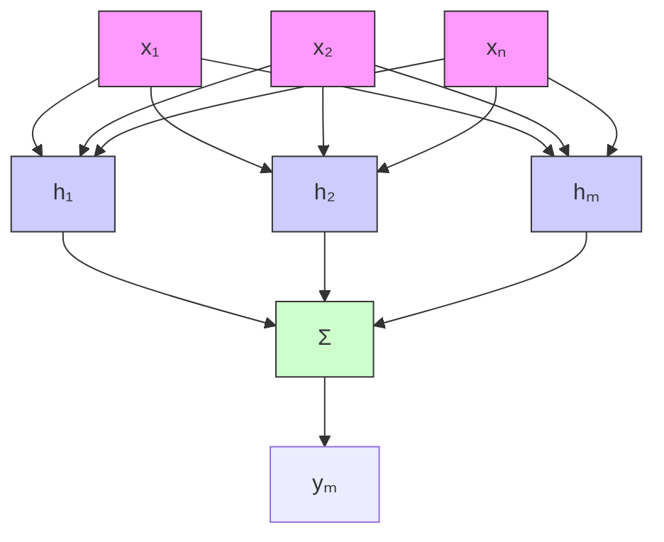

# 7.3.1 RBF网络结构与算法

多输入单输出的 RBF 网络结构如图 7-13 所示。

在 RBF 神经网络中, $x=\left[x_{1}\quad x_{2}\quad\cdots\quad x_{n}\right]^{\mathrm{T}}$ 为网络输入, $h_{j}$ 为隐含层第 j 个神经元的输出,即

$$h _ {j} = \exp \left(- \frac {\| x - c _ {j} \| ^ {2}}{2 b _ {j} ^ {2}}\right), j = 1, 2, \dots , m \tag {7.20}$$

式中， $c_{j}=\left[c_{j1},\cdots,c_{jn}\right]$ 为第 j 个隐层神经元的中心点向量值。

高斯基函数的宽度向量为

$$\boldsymbol {b} = \left[ b _ {1}, \dots , b _ {m} \right] ^ {\mathrm{T}}$$

式中， $b_{j}>0$ 为隐含层神经元 j 的高斯基函数的宽度。

网络的权值为

flowchart

图 7-13 RBF 神经网络结构

$$\boldsymbol {w} = \left[ w _ {1}, \dots , w _ {m} \right] ^ {\mathrm{T}} \tag {7.21}$$

RBF 网络的输出为

$$y _ {m} (t) = w _ {1} h _ {1} + w _ {2} h _ {2} + \dots \dots + w _ {m} h _ {m} \tag {7.22}$$

由于 RBF 网络只调节权值, 因此, RBF 网络较 BP 网络有算法简单、运行时间快的优点。但由于 RBF 网络中, 输入空间到输出空间是非线性的, 而隐含空间到输出空间是线性的, 因而其非线性能力不如 BP 网络。
