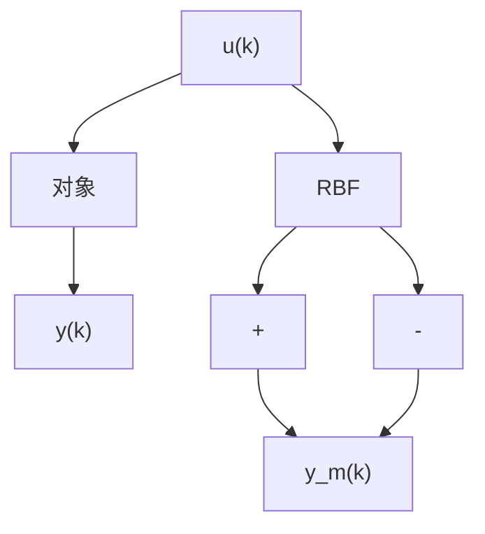

# 1. 基本原理

采用 RBF 网络对模型进行逼近, 结构如图 7-19 所示。

flowchart

图7-19 RBF神经网络逼近

网络逼近的误差指标为

$$E (t) = \frac {1}{2} \left(y (t) - y _ {m} (t)\right) ^ {2} \tag {7.23}$$

根据梯度下降法,权值按以下方式调节

$$\Delta w _ {j} (t) = - \eta \frac {\partial E}{\partial w _ {j}} = \eta (y (t) - y _ {m} (t)) h _ {j}w _ {j} (t) = w _ {j} (t - 1) + \Delta w _ {j} (t) + \alpha \left(w _ {j} (t - 1) - w _ {j} (t - 2)\right) \tag {7.24}$$

式中， $\eta \in (0,1)$ 为学习速率， $\alpha \in (0,1)$ 为动量因子。

在 RBF 网络设计中,需要注意的是,将 $c_{j}$ 和 b 值设计在网络输入有效的映射范围内,否则高斯基函数将不能保证实现有效的映射,导致 RBF 网络失效。如果将 $c_{j}$ 和 b 的初始值设计在有效的映射范围内,则只调节网络的权值便可实现 RBF 网络的有效学习。
