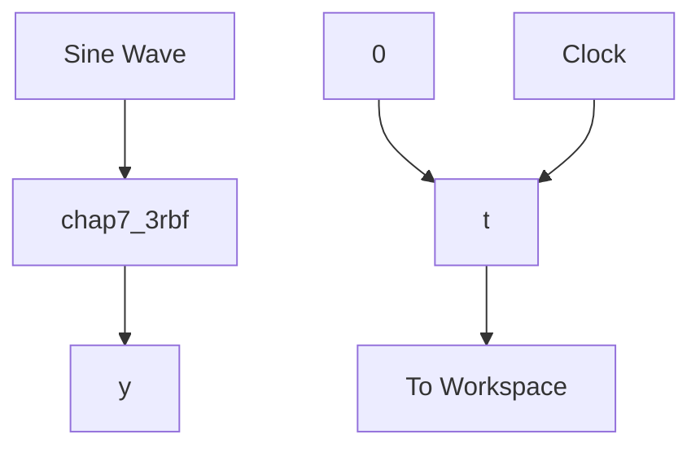

# 1. 结构为 1-5-1 的 RBF 网络

(1)Simulink 主程序:chap7\_3sim.mdl


<details>
<summary>flowchart</summary>


</details>

(2) RBF 网络: chap7\_3rbf. m

```matlab
function [sys,x0,str,ts] = spacemodel(t,x,u,flag)
switch flag,
case 0,
    [sys,x0,str,ts]=mdlInitializeSizes;
case 3,
    sys=mdlOutputs(t,x,u);
case {2,4,9}
    sys=[];
otherwise
    error(['Unhandled flag = ',num2str(flag)]);
end
function [sys,x0,str,ts]=mdlInitializeSizes
sizes = simsizes;
sizes.NumContStates = 0;
sizes.NumDiscStates = 0;
sizes.NumOutputs = 7;
sizes.NumInputs = 1;
sizes.DirFeedthrough = 1;
sizes.NumSampleTimes = 0;
sys = simsizes(sizes);
x0 = [];
str = [];
ts = [];
function sys=mdlOutputs(t,x,u)
x=u(1); % Input Layer

% i=1
% j=1,2,3,4,5
% k=1
c=[-0.5 -0.25 0 0.25 0.5]; % cij
b=[0.2 0.2 0.2 0.2 0.2]'; % bj

W=ones(5,1); % Wj
h=zeros(5,1); % hj
for j=1:1:5 
```

```matlab
h(j)=exp(-norm(x-c(:,j))^2/(2*b(j)*b(j))); % Hidden Layer
end
y=W'*h; % Output Layer
sys(1)=y;
sys(2)=x;
sys(3)=h(1);
sys(4)=h(2);
sys(5)=h(3);
sys(6)=h(4);
sys(7)=h(5); 
```

(3)作图程序:chap7\_3plot.m   
```matlab
close all;

figure(1);
plot(t,y(:,1),'k','linewidth',2);
xlabel('time(s)');ylabel('y');

figure(2);
plot(y(:,2),y(:,3),'k','linewidth',2);
xlabel('x');ylabel('hj');
hold on;
plot(y(:,2),y(:,4),'k','linewidth',2);
hold on;
plot(y(:,2),y(:,5),'k','linewidth',2);
hold on;
plot(y(:,2),y(:,6),'k','linewidth',2);
hold on;
plot(y(:,2),y(:,7),'k','linewidth',2); 
```
