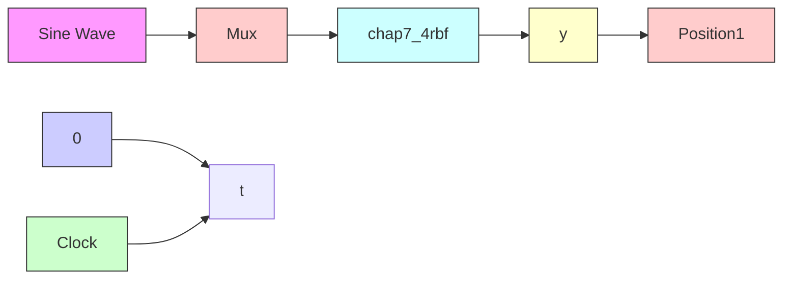

# 2. 结构为 2-5-1 的 RBF 网络

(1)Simulink 主程序:chap7\_4sim.mdl


<details>
<summary>flowchart</summary>


</details>

(2) RBF 网络: chap7\_4rbf. m

```matlab
function [sys,x0,str,ts] = spacemodel(t,x,u,flag)
switch flag,
case 0,
[sys,x0,str,ts]=mdlInitializeSizes;
case 3,
sys=mdlOutputs(t,x,u); 
```

```matlab
case {2,4,9}
sys=[];
otherwise
    error(['Unhandled flag = ',num2str(flag)]);
end
function [sys,x0,str,ts]=mdlInitializeSizes
sizes=simsizes;
sizes.NumContStates =0;
sizes.NumDiscStates =0;
sizes.NumOutputs =8;
sizes.NumInputs =2;
sizes.DirFeedthrough =1;
sizes.NumSampleTimes =0;
sys=simsizes(sizes);
x0 = [];
str = [];
ts = [];
function sys=mdlOutputs(t,x,u)
x1=u(1); % Input Layer
x2=u(2);
x=[x1 x2]'; 
```

```matlab
% i=2
% j=1,2,3,4,5
% k=1
c=[-0.5 - 0.25 0 0.25 0.5;
    -0.5 - 0.25 0 0.25 0.5]; % cij
b=[0.2 0.2 0.2 0.2 0.2]'; % bj 
```

```matlab
W=ones(5,1); % Wj
h=zeros(5,1); % hj
for j=1:1:5
    h(j)=exp(-norm(x-c(:,j))^2/(2*b(j)*b(j))); % Hidden Layer
end
yout=W'* h; % Output Layer

sys(1)=yout;
sys(2)=x1;
sys(3)=x2;
sys(4)=h(1);
sys(5)=h(2);
sys(6)=h(3);
sys(7)=h(4);
sys(8)=h(5); 
```

(3) 作图程序: chap7\_4plot.m

```matlab
close all;
figure(1);
plot(t,y(:,1),'k','linewidth',2); 
```

```txt
xlabel('time(s)');ylabel('y');
figure(2);
plot(y(:,2),y(:,4),'k','linewidth',2);
xlabel('x1');ylabel('hj');
hold on;
plot(y(:,2),y(:,5),'k','linewidth',2);
hold on;
plot(y(:,2),y(:,6),'k','linewidth',2);
hold on;
plot(y(:,2),y(:,7),'k','linewidth',2);
hold on;
plot(y(:,2),y(:,8),'k','linewidth',2);
figure(3);
plot(y(:,3),y(:,4),'k','linewidth',2);
xlabel('x2');ylabel('hj');
hold on;
plot(y(:,3),y(:,5),'k','linewidth',2);
hold on;
plot(y(:,3),y(:,6),'k','linewidth',2);
hold on;
plot(y(:,3),y(:,7),'k','linewidth',2);
hold on;
plot(y(:,3),y(:,8),'k','linewidth',2); 
```
