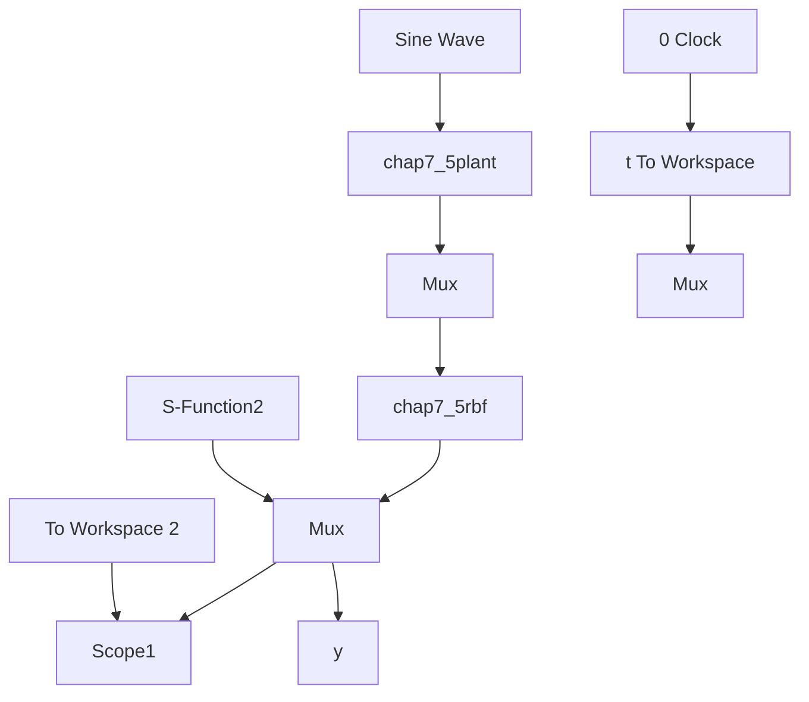

# 实例 1: 连续系统

(1) Simulink 主程序: chap7\_5sim.mdl


<details>
<summary>flowchart</summary>


</details>

(2) RBF 网络程序: chap7\_5rbf. m

```matlab
function [sys,x0,str,ts]=s_function(t,x,u,flag)
switch flag,
case 0,
[sys,x0,str,ts]=mdlInitializeSizes;
case 3,
sys=mdlOutputs(t,x,u);
case {2,4,9}
sys = []; 
```

```matlab
otherwise
    error(['Unhandled flag = ',num2str(flag)]);
end

function [sys,x0,str,ts]=mdlInitializeSizes
sizes=simsizes;
sizes.NumContStates =0;
sizes.NumDiscStates =0;
sizes.NumOutputs =1;
sizes.NumInputs =2;
sizes.DirFeedthrough =1;
sizes.NumSampleTimes =0;
sys=simsizes(sizes);
x0=[];
str=[];
ts=[];
function sys=mdlOutputs(t,x,u)
persistent w w_1 w_2 b ci
alfa=0.05;
xite=0.5;
if t==0
b=1.5;
    ci=[-1 -0.5 0 0.5 1;
    -10 -5 0 5 10];
w=rands(5,1);
w_1=w;w_2=w_1;
end
ut=u(1);
yout=u(2);
xi=[ut yout]';
for j=1:1:5
    h(j)=exp(-norm(xi-ci(:,j))^2/(2*b^2));
end
ymout=w'*h';

d_w=0*w;
for j=1:1:5 % Only weight value update
    d_w(j)=xite*(yout-ymout)*h(j);
end
w=w_1+d_w+alfa*(w_1-w_2);

w_2=w_1;w_1=w;
sys(1)=ymout; 
```

(3) 逼近对象程序: chap7\_5plant.m  
```txt
function [sys,x0,str,ts]=s_function(t,x,u,flag)
switch flag,
case 0,
[sys,x0,str,ts]=mdlInitializeSizes;
case 1, 
```

```matlab
sys=mdlDerivatives(t,x,u);
case 3,
    sys=mdlOutputs(t,x,u);
case {2, 4, 9}
    sys = [];
otherwise
    error(['Unhandled flag = ',num2str(flag)]);
end
function [sys,x0,str,ts]=mdlInitializeSizes
sizes=simsizes;
sizes.NumContStates =2;
sizes.NumDiscStates =0;
sizes.NumOutputs =1;
sizes.NumInputs =1;
sizes.DirFeedthrough =0;
sizes.NumSampleTimes =0;
sys=simsizes(sizes);
x0=[0,0];
str=[];
ts=[];
function sys=mdlDerivatives(t,x,u)
sys(1)=x(2);
sys(2)=-25*x(2)+133*u;
function sys=mdlOutputs(t,x,u)
sys(1)=x(1); 
```

(4)作图程序:chap7\_5plot.m

close all;

figure(1);

plot(t,y(:,1),'r',t,y(:,2),'k:','linewidth',2);

xlabel('time(s)');ylabel('y and ym');

legend('ideal signal', 'signal approximation');
