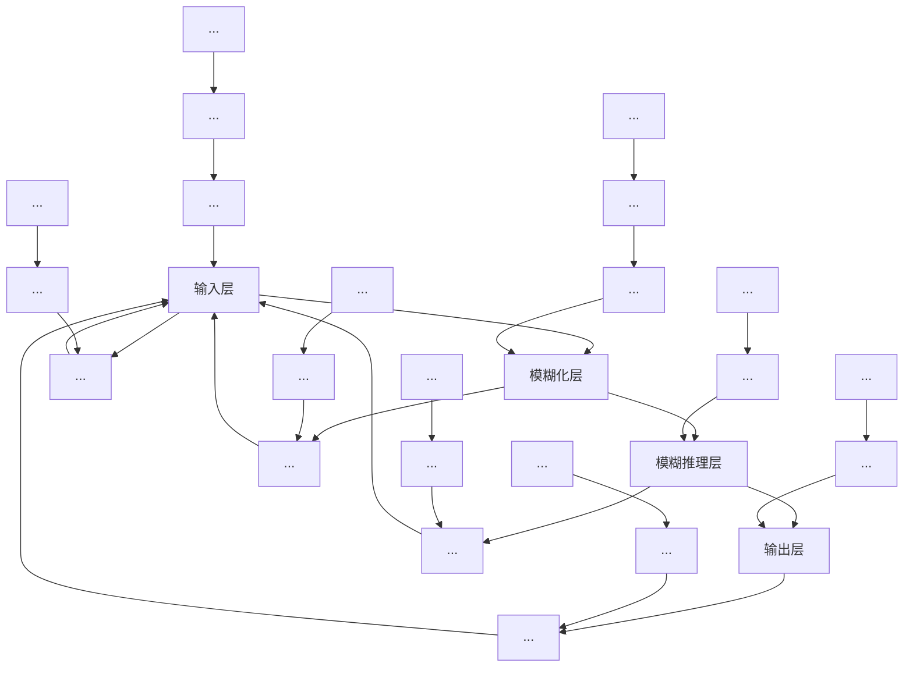

# 8.1.1 网络结构

图 8-1 所示为模糊 RBF 神经网络结构,该网络由输入层、模糊化层、模糊推理层和输出层构成。

模糊 RBF 网络中信号传播及各层的功能表示如下：

第一层:输入层

该层的各个节点直接与输入量的各个分量连接, 将输入量传到下一层。对该层的每个节点 i 的输入输出表示为

$$f _ {1} (i) = x, \tag {8.1}$$

flowchart

图 8-1 模糊 RBF 神经网络结构

第二层:模糊化层

采用高斯型函数作为隶属函数, $c_{ij}$ 和 $b_{j}$ 分别是第i个输入变量第j个模糊集合的隶属函数的均值和标准差。即

$$f _ {2} (i, j) = \exp (\mathrm{net} _ {j} ^ {2}) \tag {8.2}\mathrm{net} _ {j} ^ {2} = - \frac {(f _ {1} (i) - c _ {i j}) ^ {2}}{(b _ {j}) ^ {2}} \tag {8.3}$$

第三层:模糊推理层,实现规则的前提推理,该层的每个节点相当于一条规则。

该层通过与模糊化层的连接来完成模糊规则的匹配,各个节点之间实现模糊运算,即通过各个模糊节点的组合得到相应的点火强度。每个节点j的输出为该节点所有输入信号的乘积,即

$$f _ {3} (j) = \prod_ {j = 1} ^ {N} f _ {2} (i, j) \tag {8.4}$$

式中， $N=\prod_{i=1}^{n}N_{i},N_{i}$ 为输入层中第 i 个输入隶属函数的个数，即模糊化层节点数。

第四层: 输出层, 实现规则前提与结论的推理及规则间的推理。

输出层为 $f_{4}$ ，即

$$f _ {4} (l) = \pmb {W} \bullet f _ {3} = \sum_ {j = 1} ^ {N} w (l, j) \bullet f _ {3} (j) \tag {8.5}$$

式中，l 为输出层节点的个数，W 为输出层节点与第三层各节点的连接权矩阵。
