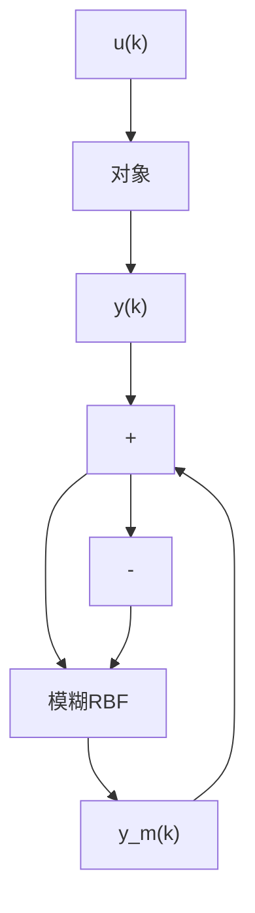

# 8.1.2 基于模糊RBF网络的逼近算法

采用模糊 RBF 网络逼近对象, 取网络结构为 2-4-1, 如图 8-2 所示。

取 $y_{m}(k)=f_{4},y_{m}(k)$ 和 $y(k)$ 分别表示网络输出和实际输出。网络的输入 $x_{1}$ 和 $x_{2}$ 为 $u(k)$ 和 $y(k)$ ，网络的输出为 $y_{m}(k)$ ，则网络逼近误差为

flowchart

图 8-2 模糊 RBF 神经网络逼近

$$e (k) = y (k) - y _ {m} (k) \tag {8.6}$$

采用梯度下降法来修正可调参数,定义目标函数为

$$E = \frac {1}{2} e (k) ^ {2} \tag {8.7}$$

网络的学习算法如下：

输出层的权值通过如下方式来调整

$$\Delta w (k) = - \eta \frac {\partial E}{\partial w} = - \eta \frac {\partial E}{\partial e} \frac {\partial e}{\partial y _ {m}} \frac {\partial y _ {m}}{\partial w} = \eta e (k) f _ {3}$$

则输出层的权值学习算法为

$$w (k) = w (k - 1) + \Delta w (k) + \alpha (w (k - 1) - w (k - 2)) \tag {8.8}$$

式中， $\eta$ 为学习速率， $\alpha$ 为动量因子， $\eta\in(0,1),\alpha\in(0,1)$ 。

在 RBF 网络设计中,需要将 $c_{ij}$ 和 $b_{j}$ 值的设计在网络输入有效的映射范围内,否则高斯基函数将不能保证实现有效的映射,导致 RBF 网络失效。如果将 $c_{ij}$ 和 $b_{j}$ 的初始值设计在有效的映射范围内,则只调节网络的权值便可实现 RBF 网络的有效学习。
