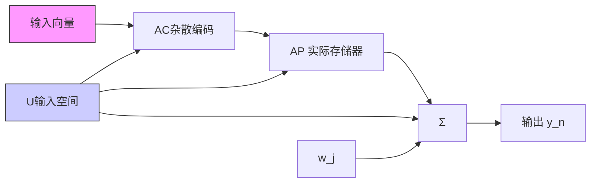

# 8.2.1 CMAC概述

小脑模型神经网络(Cerebellar Model Articulation Controller, CMAC)是一种表达复杂非线性函数的表格查询型自适应神经网络,该网络可通过学习算法改变表格的内容,具有信息分类存储的能力。

CMAC 把系统的输入状态作为一个指针, 把相关信息分布式地存入一组存储单元中。它本质上是一种用于映射复杂非线性函数的查表技术。具体做法是将输入空间分成许多分块, 每个分块指定一个实际存储器位置; 每个分块学习到的信息分布式地存储到相邻分块的位置上; 存储单元数通常比所考虑问题的最大可能输入空间的分块数少得多, 故实现的是多对一的映射, 即多个分块映射到同样一个存储器地址上。

CMAC 已被公认为是一类联想记忆神经网络的重要组成部分, 它能够学习任意多维非线性映射。CMAC 算法可有效地用于非线性函数逼近、动态建模、控制系统设计等。CMAC 较其他神经网络的优越性体现在:

① 它是基于局部学习的神经网络,它把信息存储在局部结构上,使每次修正的权很少,在保证函数非线性逼近性能的前提下,学习速度快,适合于实时控制;

② 具有一定的泛化能力, 即所谓相近输入产生相近输出, 不同输入给出不同输出;

③ 连续(模拟)输入、输出能力；

④ 寻址编程方式,在利用串行计算机仿真时,它可使回响速度加快;

⑤作为非线性逼近器,它对学习数据出现的次序不敏感。

由于 CMAC 所具有的上述优越性能,使它比一般神经网络具有更好的非线性逼近能力,更适合于复杂动态环境下的非线性实时控制。

CMAC 的基本思想在于: 在输入空间中给出一个状态, 从存储单元中找到对应于该状态的地址, 将这些存储单元中的内容求和得到 CMAC 的输出; 将此响应值与期望输出值进行比较, 并根据学习算法修改这些已激活的存储单元的内容。

CMAC 的结构如图 8-5 所示。

flowchart

图 8-5 CMAC 结构
