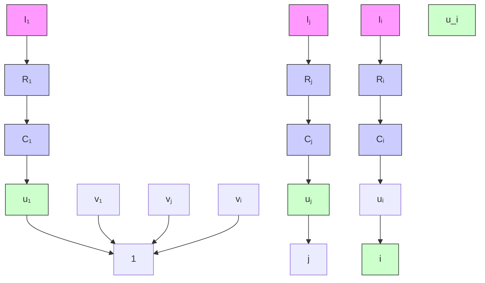

# 8.3.1 Hopfield 网络原理

1986 年美国物理学家 J. J. Hopfield 利用非线性动力学系统理论中的能量函数方法研究反馈人工神经网络的稳定性, 提出了 Hopfield 神经网络, 并建立了求解优化计算问题的方程。

基本的 Hopfield 神经网络是一个由非线性元件构成的全连接型单层反馈系统, Hopfield 网络中的每一个神经元都将自己的输出通过连接权传送给所有其他神经元, 同时又都接收所有其他神经元传递过来的信息。Hopfield 神经网络是一个反馈型神经网络, 网络中的神经元在 $t$ 时刻的输出状态实际上间接地与自己的 $t - 1$ 时刻的输出状态有关, 其状态变化可以用差分方程来描述。反馈型网络的一个重要特点就是它具有稳定状态, 当网络达到稳定状态时, 也就是它的能量函数达到最小的时候。

Hopfield 网络分离散型和连续型两种,本书介绍连续型 Hopfield 网络。

Hopfield 神经网络的能量函数不是物理意义上的能量函数,而是在表达形式上与物理意义上的能量概念一致,表征网络状态的变化趋势,并可以依据 Hopfield 工作运行规则不断进行状态变化,最终能够达到的某个极小值的目标函数。网络收敛就是指能量函数达到极小值。如果把一个最优化问题的目标函数转换成网络的能量函数,把问题的变量对应于网络的状态,那么 Hopfield 神经网络就能够用于解决优化组合问题。

Hopfield 神经网络工作时, 各个神经元的连接权值是固定的, 更新的只是神经元的输出状态。Hopfield 神经网络的运行规则为: 首先从网络中随机选取一个神经元 $u_{i}$ 进行加权求和, 再计算 $u_{i}$ 的第 $t + 1$ 时刻的输出值。除 $u_{i}$ 以外的所有神经元的输出值保持不变, 直至网络进入稳定状态。

Hopfield 神经网络模型是由一系列互连的神经元组成的反馈型网络，如图 8-7 所示，其中虚线框内为一个神经元， $u_{i}$ 为第 i 个神经元的状态输入， $R_{i}$ 与 $C_{i}$ 分别为输入电阻和输入电容， $I_{i}$ 为输入电流， $w_{ij}$ 为第 j 个神经元到第 i 个神经元的连接权值。 $v_{i}$ 为神经元的输出，是神经元状态变量 $u_{i}$ 的非线性函数。

flowchart

图8-7 Hopfield神经网络模型

对于 Hopfield 神经网络的第 i 个神经元,采用微分方程建立其输入、输出关系,即

$$
\left\{ \begin{array}{l} C _ {i} \frac {\mathrm{d} u _ {i}}{\mathrm{d} t} = \sum_ {j = 1} ^ {n} w _ {i j} v _ {j} - \frac {u _ {i}}{R _ {i}} + I _ {i} \\ v _ {i} = g (u _ {i}) \end{array} \right. \tag {8.16}
$$

式中， $i=1,2,\cdots,n$ 。

函数 $g(\cdot)$ 为双曲函数,一般取为

$$g (x) = \rho \frac {1 - \mathrm{e} ^ {- \lambda x}}{1 + \mathrm{e} ^ {- \lambda x}} \tag {8.17}$$

式中， $\rho>0,\lambda>0$ 。
