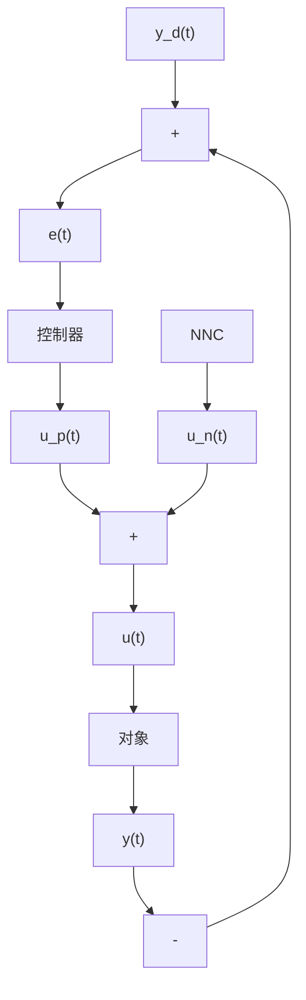

# 9.2.1 神经网络监督控制

通过对传统控制器进行学习,然后用神经网络控制器逐渐取代传统控制器的方法,称为神经网络监督控制。神经网络监督控制的结构如图9-1所示。神经网络控制器实际上是一个前馈控制器,它建立的是被控对象的逆模型。神经网络控制器通过对传统控制器的输出进行学习,在线调整网络的权值,使反馈控制输入 $u_{\mathrm{p}}(t)$ 趋近于零,从而使神经网络控制器逐渐在控制作用中占据主导地位,最终取消反馈控制器的作用。一旦系统出现干扰,反馈控制器将重新起作用。因此,这种前馈加反馈的监督控制方法,不仅可以确保控制系统的稳定性和鲁棒性,而且可有效地提高系统的精度和自适应能力。

flowchart

图9-1 神经网络监督控制
