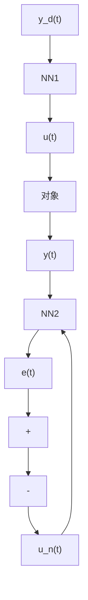
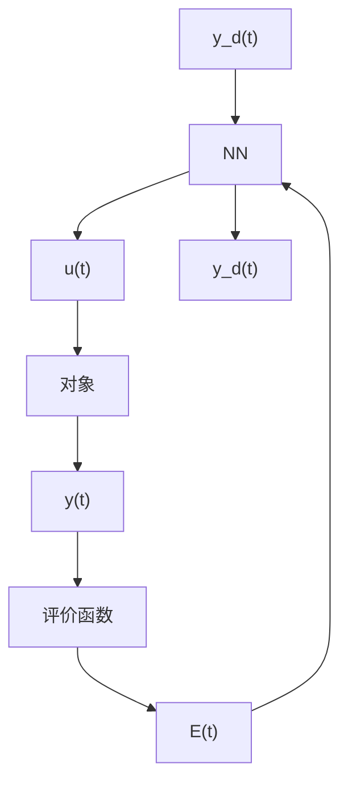

# 9.2.2 神经网络直接逆控制

神经网络直接逆控制就是将被控对象的神经网络逆模型直接与被控对象串联起来,以便使期望输出与对象实际输出之间的传递函数为1。则将此网络作为前馈控制器后,被控对象的输出为期望输出。

显然,神经网络直接逆控制的可用性在相当程度上取决于逆模型的准确精度。由于缺乏反馈,简单连接的直接逆控制缺乏鲁棒性。为此,一般应使其具有在线学习能力,即作为逆模型的神经网络连接权能够在线调整。

图 9-2 所示为神经网络直接逆控制的两种结构方案。在图 9-2(a) 中，NN1 和 NN2 为具有完全相同的网络结构，并采用相同的学习算法，分别实现对象的逆。在图 9-2(b) 中，神经网络 NN 通过评价函数进行学习，实现对象的逆控制。

flowchart

(a)

flowchart

(b)   
图 9-2 神经网络直接逆控制的两种结构方案
