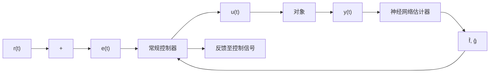

# 1. 神经网络自校正控制

神经网络自校正控制分为直接自校正控制和间接自校正控制。间接自校正控制使用常规控制器，神经网络估计器需要较高的建模精度。直接自校正控制同时使用神经网络控制器和神经网络估计器。

(1) 神经网络直接自校正控制

在本质上同神经网络直接逆控制,其结构如图 9-2 所示。

(2) 神经网络间接自校正控制

其结构如图 9-3 所示。假设被控对象为如下单变量仿射非线性系统

flowchart

图 9-3 神经网络间接自校正控制

若利用神经网络对非线性函数 $f(y_{t})$ 和 $g(y_{t})$ 进行逼近, 得到 $\hat{f}(y_{t})$ 和 $\hat{g}(y_{t})$ , 则常规控制器为

$$u (t) = [ r (t) - \hat {f} (y _ {t}) ] / \hat {g} (y _ {t})$$

式中， $r(t)$ 为 t 时刻的期望输出值。
