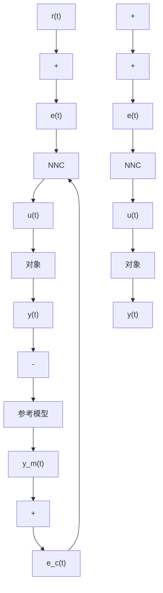
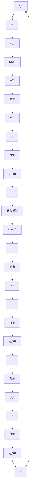

# (2) 间接模型参考自适应控制

如图 9-5 所示。神经网络辨识器 NNI 向神经网络控制器 NNC 提供对象的 Jacobian 信息，用于控制器 NNC 的学习。

flowchart

```mermaid
graph TD
    A["r(t)"] --> B["+"]
    B --> C["e(t)"]
    C --> D["NNC"]
    D --> E["u(t)"]
    E --> F["对象"]
    F --> G["y(t)"]
    G --> H["-"]
    H --> I["参考模型"]
    I --> J["y_m(t)"]
    J --> K["+"]
    K --> L["e_c(t)"]
    L --> D
    M["+"] --> N["+"]
    N --> O["e(t)"]
    O --> P["NNC"]
    P --> Q["u(t)"]
    Q --> R["对象"]
    R --> S["y(t)"]
```

图 9-4 神经网络直接模型参考自适应控制

flowchart

```mermaid
graph TD
    A["r(t)"] --> B["+"]
    B --> C["e(t)"]
    C --> D["NNC"]
    D --> E["e(t)"]
    E --> F["对象"]
    F --> G["y(t)"]
    G --> H["+"]
    H --> I["NNI"]
    I --> J["y_n(t)"]
    J --> K["+"]
    K --> L["参考模型"]
    L --> M["y_m(t)"]
    M --> N["+"]
    N --> O["对象"]
    O --> P["y_t"]
    P --> Q["+"]
    Q --> R["NNI"]
    R --> S["y_n(t)"]
    S --> T["+"]
    T --> U["对象"]
    U --> V["y_t"]
    V --> W["+"]
    W --> X["NNI"]
    X --> Y["y_n(t)"]
    Y --> Z["+"]
    Z --> A
```

图 9-5 神经网络间接模型参考自适应控制
