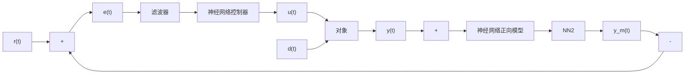

# 9.2.4 神经网络内模控制

经典的内模控制将被控系统的正向模型和逆模型直接加入反馈回路,系统的正向模型作为被控对象的近似模型与实际对象并联,两者输出之差被用做反馈信号,该反馈信号又经过前向通道的滤波器及控制器进行处理。控制器直接与系统的逆有关,通过引入滤波器来提高系统的鲁棒性。图9-6所示为神经网络内模控制,被控对象的正向模型及控制器均由神经网络来实现,NN2实现对象的逼近,NN1实现对象的逆。

flowchart

图 9-6 神经网络内模控制
