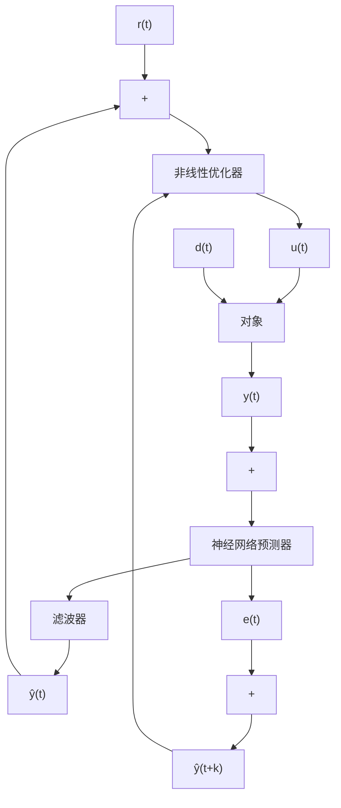

# 9.2.5 神经网络预测控制

预测控制又称为基于模型的控制,是20世纪70年代后期发展起来的一类新型计算机控制方法,该方法的特征是预测模型、滚动优化和反馈校正。

神经网络预测控制的结构如图 9-7 所示, 神经网络预测器建立了非线性被控对象的预测模型，并可在线进行学习修正。利用此预测模型，可以由当前的系统控制信息预测出在未来一段时间 $(t+k)$ 范围内的输出值 $\hat{y}(t+k)$ 。通过设计优化性能指标，利用非线性优化器可求出优化的控制作用 $u(t)$ 。

flowchart

图 9-7 神经网络预测控制
