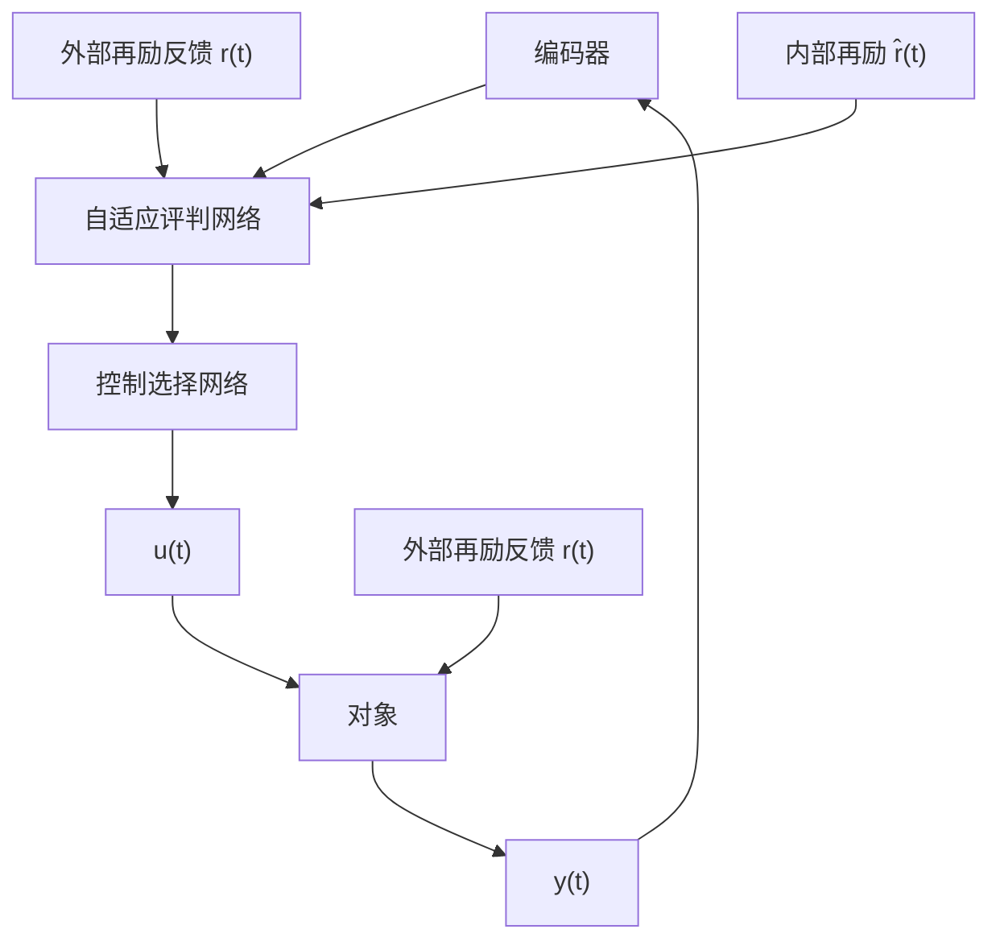

# 9.2.6 神经网络自适应评判控制

神经网络自适应评判控制通常由两个网络组成,如图9-8所示。其中自适应评判网络在控制系统中相当于一个需要进行再励学习的“教师”,它通过不断的奖励、惩罚等再励学习,使自己逐渐成为一个合格的“教师”,学习完成后,根据系统目前的状态和外部再励反馈信号 $r(t)$ 产生一个内部再励信号 $\hat{r}(t)$ ,以对目前的控制效果做出评价。控制选择网络相当于一个在内部再励信号 $\hat{r}(t)$ 指导下进行学习的多层前馈神经网络控制器,该网络进行学习后,根据编码后的系统状态,再允许控制集中选择下一步的控制作用。

flowchart

图9-8 神经网络自适应评判控制
