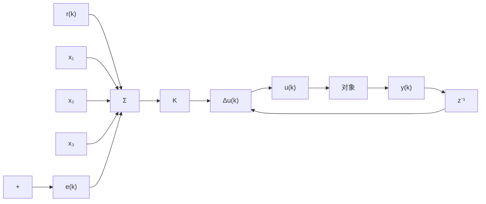

# 9.3.1 单神经元自适应控制算法

单神经元自适应控制的结构如图 9-9 所示。

flowchart

图 9-9 单神经元自适应控制结构

单神经元自适应控制器通过对加权系数的调整来实现自适应、自组织功能，控制算法为

$$u (k) = u (k - 1) + K \sum_ {i = 1} ^ {3} w _ {i} (k) x _ {i} (k) \tag {9.1}$$

如果权系数的调整按有监督的 Hebb 学习规则实现, 在学习算法中加入监督项 $z(k)$ , 则神经网络权值学习算法为

$$
\left. \begin{array}{l} w _ {1} (k) = w _ {1} (k - 1) + \eta z (k) u (k) x _ {1} (k) \\ w _ {2} (k) = w _ {2} (k - 1) + \eta z (k) u (k) x _ {2} (k) \\ w _ {3} (k) = w _ {3} (k - 1) + \eta z (k) u (k) x _ {3} (k) \end{array} \right\} \tag {9.2}
$$

式中， $z(k)=e(k)$ ， $x_{1}(k)=e(k)$ ， $x_{2}(k)=e(k)-e(k-1)$ ， $x_{3}(k)=\Delta^{2}e(k)=e(k)-2e(k-1)+e(k-2)$ ， $\eta$ 为学习速率，K为神经元的比例系数， $K>0,\eta\in(0,1)$ 。

K 值的选择非常重要。K 越大，则快速性越好，但超调量大，甚至可能使系统不稳定。当被控对象时延增大时，K 值必须减少，以保证系统稳定。K 值选择过小，会使系统的快速性变差。
