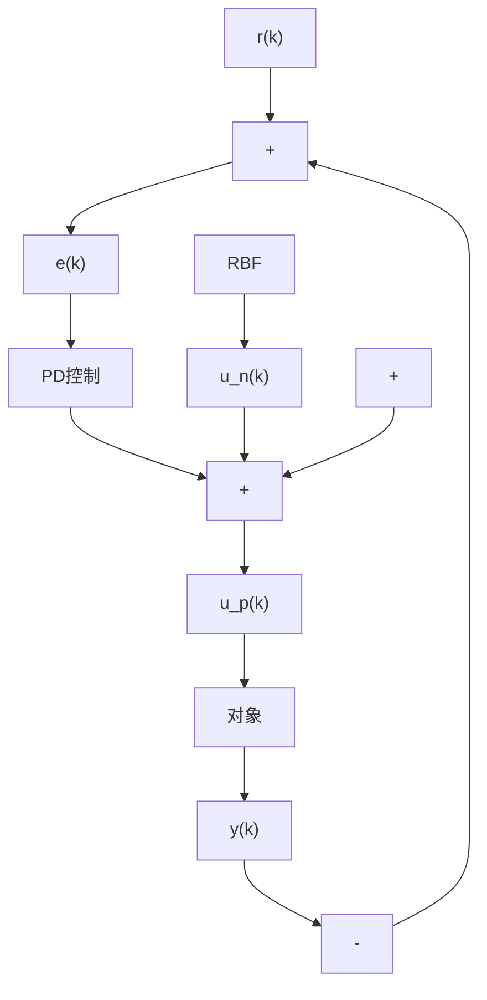

# 9.4.1 RBF 网络监督控制算法

基于 RBF 网络的监督控制系统结构如图 9-14 所示, 其设计思想见 9.2.1 节。

flowchart

图 9-14 神经网络监督控制

在 RBF 网络结构中, 取网络的输入为 $\boldsymbol{r}(k)$ , 网络的径向基向量为 $H = [h_{1}, \cdots, h_{m}]^{T}$ , $h_{j}$ 为高斯基函数, 即

$$h _ {j} = \exp \left(- \frac {\| \boldsymbol {r} (k) - \boldsymbol {C} _ {j} \| ^ {2}}{2 b _ {j} ^ {2}}\right) \tag {9.3}$$

式中， $j=1,\cdots,m,b_{j}$ 为节点 j 的基宽参数， $b_{j}>0,C_{j}$ 为网络第 j 个节点的中心向量， $C_{j}=\left[c_{11},\cdots,c_{1m}\right]^{T},B=\left[b_{1},\cdots,b_{m}\right]^{T}$ 。

网络的权向量为

$$\boldsymbol {W} = \left[ w _ {1}, \dots , w _ {m} \right] ^ {\mathrm{T}}$$

RBF 网络的输出为

$$u _ {\mathrm{n}} (k) = h _ {1} w _ {1} + \dots + h _ {j} w _ {j} + \dots + h _ {m} w _ {m} \tag {9.4}$$

式中，m 为 RBF 网络隐层神经元的个数。

控制律为

$$u (k) = u _ {\mathrm{p}} (k) + u _ {\mathrm{n}} (k) \tag {9.5}$$

根据神经网络监督控制原理,要想使神经网络控制器占主导地位,设神经网络调整的性能指标为

$$E (k) = \frac {1}{2} (u _ {\mathrm{n}} (k) - u (k)) ^ {2} \tag {9.6}$$

近似取 $\frac{\partial u_{\mathrm{p}}(k)}{\partial w_j(k)}\approx \frac{\partial u_{\mathrm{n}}(k)}{\partial w_i(k)}$ ，由此所产生的不精确通过权值调节来补偿。

采用梯度下降法调整网络的权值为

$$\Delta w _ {j} (k) = - \eta \frac {\partial E (k)}{\partial w _ {j} (k)} = \eta (u _ {\mathrm{n}} (k) - u (k)) h _ {j} (k)$$

神经网络权值的调整过程为

$$\boldsymbol {W} (k) = \boldsymbol {W} (k - 1) + \Delta \boldsymbol {W} (k) + \alpha (\boldsymbol {W} (k - 1) - \boldsymbol {W} (k - 2)) \tag {9.7}$$

式中， $\eta$ 为学习速率， $\alpha$ 为动量因子。
