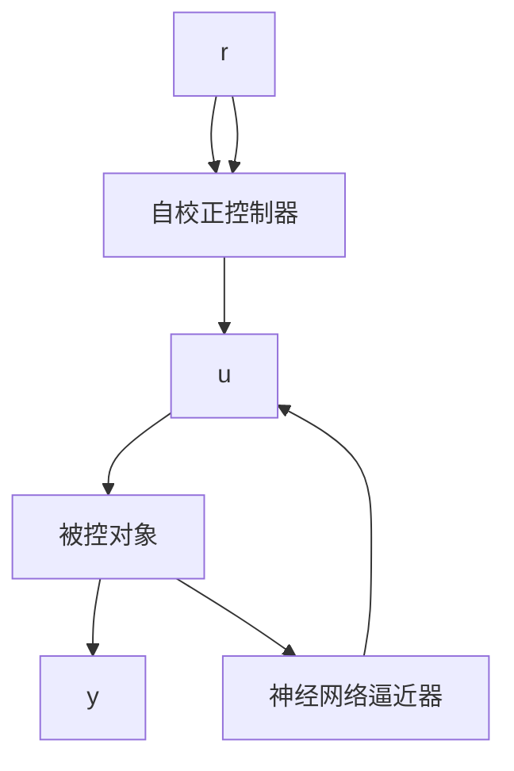

# 9.5.1 神经网络自校正控制原理

自校正控制有两种结构: 直接型与间接型。直接型自校正控制也称直接逆动态控制, 是前馈控制。间接自校正控制是一种由辨识器将对象参数进行在线估计, 用调节器(或控制器) 实现参数的自动整定相结合的自适应控制技术, 可用于结构已知而参数未知但恒定的随机系统, 也可用于结构已知而参数缓慢时变的随机系统。

神经网络间接自校正控制结构如图 9-17 所示, 它由两个回路组成:

① 自校正控制器与被控对象构成的反馈回路；

② 神经网络辨识器的设计,以得到控制器的参数。

可见,辨识器与自校正控制器的在线设计是自校正控制实现的关键。

flowchart

图 9-17 神经网络间接自校正控制框图
