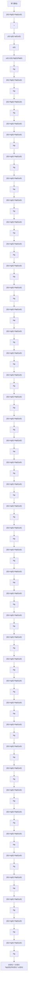

```mermaid
graph TD
    A["学习算法"] --> B["ŷ(k)=Ng(k)+Nφ(k)u(k)"]
    B --> C["+"]
    C --> D["y(k)=g(k)+φ(k)u(k)"]
    D --> E["u(k)"]
    E --> F["u(k)=(r(k)-Ng(k))/Nφ(k)"]
    F --> G["Ng"]
    G --> H["ŷ(k)=Ng(k)+Nφ(k)u(k)"]
    H --> I["Nφ"]
    I --> J["ŷ(k)=Ng(k)+Nφ(k)u(k)"]
    J --> K["Ng"]
    K --> L["ŷ(k)=ng(k)+Nφ(k)u(k)"]
    L --> M["ŷ(k)=ng(k)+Nφ(k)u(k)"]
    M --> N["Nφ"]
    N --> O["ŷ(k)=ng(k)+Nφ(k)u(k)"]
    O --> P["Ng"]
    P --> Q["ŷ(k)=ng(k)+Nφ(k)u(k)"]
    Q --> R["Nφ"]
    R --> S["ŷ(k)=ng(k)+Nφ(k)u(k)"]
    S --> T["Ng"]
    T --> U["ŷ(k)=ng(k)+Nφ(k)u(k)"]
    U --> V["Nφ"]
    V --> W["ŷ(k)=ng(k)+Nφ(k)u(k)"]
    W --> X["Ng"]
    X --> Y["ŷ(k)=ng(k)+Nφ(k)u(k)"]
    Y --> Z["Nφ"]
    Z --> AA["ŷ(k)=ng(k)+Nφ(k)u(k)"]
    AA --> AB["Ng"]
    AB --> AC["ŷ(k)=ng(k)+Nφ(k)u(k)"]
    AC --> AD["Nφ"]
    AD --> AE["ŷ(k)=ng(k)+Nφ(k)u(k)"]
    AE --> AF["Ng"]
    AF --> AG["ŷ(k)=ng(k)+Nφ(k)u(k)"]
    AG --> AH["Nφ"]
    AH --> AI["ŷ(k)=ng(k)+Nφ(k)u(k)"]
    AI --> AJ["Ng"]
    AJ --> AK["ŷ(k)=ng(k)+Nφ(k)u(k)"]
    AK --> AL["Nφ"]
    AL --> AM["ŷ(k)=ng(k)+Nφ(k)u(k)"]
    AM --> AN["Ng"]
    AN --> AO["ŷ(k)=ng(k)+Nφ(k)u(k)"]
    AO --> AP["Nφ"]
    AP --> AQ["ŷ(k)=ng(k)+Nφ(k)u(k)"]
    AQ --> AR["Ng"]
    AR --> AS["ŷ(k)=ng(k)+Nφ(k)u(k)"]
    AS --> AT["Nφ"]
    AT --> AU["ŷ(k)=ng(k)+Nφ(k)u(k)"]
    AU --> AV["Ng"]
    AV --> AW["ŷ(k)=ng(k)+Nφ(k)u(k)"]
    AW --> AX["Nφ"]
    AX --> AY["ŷ(k)=ng(k)+Nφ(k)u(k)"]
    AY --> AZ["Ng"]
    AZ --> BA["ŷ(k)=ng(k)+Nφ(k)u(k)"]
    BA --> BB["Nφ"]
    BB --> BC["ŷ(k)=ng(k)+Nφ(k)u(k)"]
    BC --> BD["Ng"]
    BD --> BE["ŷ(k)=ng(k)+Nφ(k)u(k)"]
    BE --> BF["Nφ"]
    BF --> BG["ŷ(k)=ng(k)+Nφ(k)u(k)"]
    BG --> BH["Ng"]
    BH --> BI["ŷ(k)=ng(k)+Nφ(k)u(k)"]
    BI --> BJ["Nφ"]
    BJ --> BK["ŷ(k)=ng(k)+Nφ(k)u(k)"]
    BK --> BL["Ng"]
    BL --> BM["ŷ(k)=ng(k)+Nφ(k)u(k)"]
    BM --> BN["Nφ"]
    BN --> BO["ŷ(k)=ng(k)+Nφ(k)u(k)"]
    BO --> BP["Ng"]
    BP --> BQ["ŷ(k)=ng(k)+Nφ(k)u(k)"]
    BQ --> BR["Nφ"]
    BR --> BS["ŷ(k)=ng(k)+Nφ(k)u(k)"]
    BS --> BT["Ng"]
    BT --> BU["ŷ(k)=ng(k)+Nφ(k)u(k)"]
    BU --> BV["Nφ"]
    BV --> BW["ŷ(k)=ng(k)+Nφ(k)u(k)"]
    BW --> BX["Ng"]
    BX --> BY["ŷ(k)=ng(k)+Nφ(k)u(k)"]
    BY --> BZ["Nφ"]
    BZ --> CA["ŷ(k)=ng(k)+Nφ(k)u(k)"]
    CA --> CB["Ng"]
    CB --> CC["ŷ(k)=ng(k)+Nφ(k)u(k)"]
    CC --> CD["Nφ"]
    CD --> CE["ŷ(k)=ng(k)+Nφ(k)u(k)"]
    CE --> CF["Ng"]
    CF --> CG["ŷ(k)=ng(k)+Nφ(k)u(k)"]
    CG --> CH["Nφ"]
    CH --> CI["ŷ(k)=ng(k)+Nφ(k)u(k)"]
    CI --> CJ["Ng"]
    CJ --> CK["ŷ(η̂(k)) = (r(η̂(k)-Ng(η̂(k))/N(η̂(k)) / u(η̂(k))"]
```

图 9-19 神经网络自校正控制框图

由于本方法采用梯度下降法调节权值,无法保证闭环系统稳定性,只适合于慢时变系统的控制。
