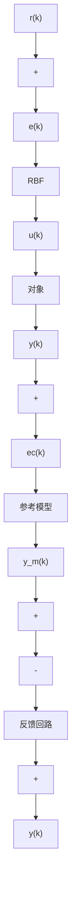

# 9.6.1 基于 RBF 网络的控制器设计

控制系统的结构如图 9-23 所示。

flowchart

图 9-23 基于 RBF 网络的直接模型参考自适应控制

设参考模型输出为 $y_{m}(k)$ ，控制系统要求对象的输出 $y(k)$ 能够跟踪参考模型的输出 $y_{m}(k)$ 。则跟踪误差为

$$e c (k) = y _ {m} (k) - y (k) \tag {9.20}$$

控制目标函数为

$$E (k) = \frac {1}{2} e c (k) ^ {2} \tag {9.21}$$

控制器为 RBF 网络的输出为

$$u (k) = h _ {1} w _ {1} + \dots + h _ {j} w _ {j} + \dots + h _ {m} w _ {m} \tag {9.22}$$

式中，m 为 RBF 网络隐层神经元的个数， $w_{j}$ 为第 j 个网络隐层神经元与输出层之间的连接权， $h_{j}$

为第 $j$ 个隐层神经元的输出。

在 RBF 网络结构中， $X = [x_{1}, \cdots, x_{n}]^{T}$ 为网络的输入向量。RBF 网络的径向基向量为 $H = [h_{1}, \cdots, h_{m}]^{T}$ ， $h_{j}$ 为高斯基函数，即

$$h _ {j} = \exp \left(- \frac {\| \mathbf {X} - \mathbf {C} _ {j} \| ^ {2}}{2 b _ {j} ^ {2}}\right) \tag {9.23}$$

式中， $j=1,\cdots,m$ 。 $b_{j}$ 为节点 j 的基宽参数， $b_{j}>0,C_{j}$ 为网络第 j 个节点的中心向量， $C_{j}=\left[c_{j1},\cdots,c_{ji},\cdots,c_{jn}\right]^{T},B=\left[b_{1},\cdots,b_{m}\right]^{T}$

网络的权向量为

$$\boldsymbol {W} = \left[ w _ {1}, \dots , w _ {m} \right] ^ {\mathrm{T}} \tag {9.24}$$

按梯度下降法及链式法则,可得权值的学习算法如下

$$\Delta w _ {j} (k) = - \eta \frac {\partial E (k)}{\partial w} = \eta e c (k) \frac {\partial y (k)}{\partial u (k)} h _ {j}w _ {j} (k) = w _ {j} (k - 1) + \Delta w _ {j} (k) + \alpha \Delta w _ {j} (k) \tag {9.25}$$

式中， $\eta$ 为学习速率， $\alpha$ 为动量因子。

同理,可得 RBF 网络隐层神经元的高斯函数的基宽参数及中心参数的学习算法如下

$$\Delta b _ {j} (k) = - \eta \frac {\partial E (k)}{\partial b _ {j}} = \eta e c (k) \frac {\partial y (k)}{\partial u (k)} \frac {\partial u (k)}{\partial b _ {j}} = \eta e c (k) \frac {\partial y (k)}{\partial u (k)} w _ {j} h _ {j} \frac {\| x - c _ {i j} \| ^ {2}}{b _ {j} ^ {3}} \tag {9.26}b _ {j} (k) = b _ {j} (k - 1) + \eta \Delta b _ {j} (k) + \alpha \left(b _ {j} (k - 1) - b _ {j} (k - 2)\right) \tag {9.27}\Delta c _ {i j} (k) = - \eta \frac {\partial E (k)}{\partial c _ {i j}} = \eta e c (k) \frac {\partial y (k)}{\partial u (k)} \frac {\partial u (k)}{\partial c _ {i j}} = \eta e c (k) \frac {\partial y (k)}{\partial u (k)} w _ {j} h _ {j} \frac {x _ {i} - c _ {i j}}{b _ {j} ^ {2}} \tag {9.28}c _ {i j} (k) = c _ {i j} (k - 1) + \eta \Delta c _ {i j} (k) + \alpha \left(c _ {i j} (k - 1) - c _ {i j} (k - 2)\right) \tag {9.29}$$

在学习算法中， $\frac{\partial y(k)}{\partial u(k)}$ 称为 Jacobian 信息，表示系统的输出对控制输入的敏感性，其值可由神经网络辨识而得。在神经网络算法中，对 $\frac{\partial y(k)}{\partial u(k)}$ 值的精确度要求不是很高，不精确部分可通过网络参数及权值的调整来修正，关键是其符号，因此可用 $\frac{\partial y(k)}{\partial u(k)}$ 的正负号来代替，这样可使算法更加简单。
