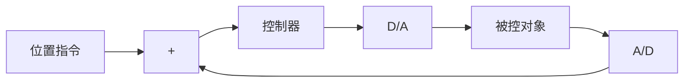
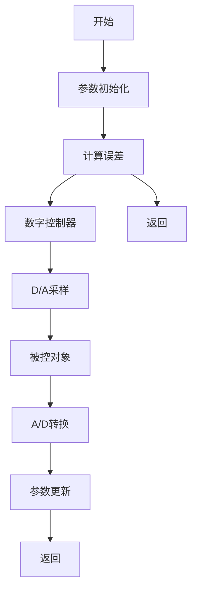

# 9.10.1 基本原理

在工程实际中,控制算法一般在计算机或 DSP 中实现,这就需要将控制算法离散化。本节讨论神经网络自适应控制律的数字化实现方法。

数字控制系统结构如图 9-34 所示, 其中控制器为数字控制算法, 被控对象的输入、输出为模拟信号, 通过 D/A 和 A/D 与数字信号相连接。数字控制算法的程序框图如图 9-35 所示。

flowchart

图 9-34 数字控制系统结构

针对9.8节中的控制算法,选择被控对象为单电机模型,其动力学模型为

$$D \ddot {q} + C \dot {q} + G = \tau + d \tag {9.74}$$

式中， $D_{0}=\frac{3}{4}ml^{2},G_{0}=mlg\cos q$ 。

取 $x_{1}=q, x_{2}=\dot{q}$ ，则方程式(9.74)可转化为动力学方程

$$\dot {x} _ {1} = x _ {2} \tag {9.75}\dot {x} _ {2} = D ^ {- 1} (\tau + d - C \dot {q} - G)$$

在 Matlab 仿真中, 在每个采样时间 T 内, 采用 Runge-Kutta 迭代算法求解式(9.75), 从而实现连续被控对象的离散求解 $^{[31]}$ , 仿真中采用了 Matlab 函数“ode45”进行离散积分求解。

针对自适应律的离散化问题,一种方法是利用采样时间进行差分的离散化,另一种方法是利用数值迭代方法进行离散化。下面介绍一种高精度数值迭代方法——RKM(Runge-Kutta-Merson) 方法 $^{[32]}$ 。以离散化 $\dot{x}=f(t,x)$ 为例,采样时间为 T,如果采用差分方法离散化, $n+1$ 时刻的 x 值为 $x_{n+1}=x_{n}+Tf(t_{n},x_{n})$ ,而采用 RKM 方法,则 $n+1$ 时刻的 x 值为

$$x _ {n + 1} = x _ {n} + \frac {1}{6} (k _ {1} + 4 k _ {4} + k _ {5}) \tag {9.76}$$

flowchart

图9-35 数字控制算法程序框图

其中

$$
\begin{array}{l} k _ {1} = T f (t _ {n}, x _ {n}) \\ k _ {2} = T f \left(t _ {n} + \frac {1}{3} T, x _ {n} + \frac {1}{3} k _ {1}\right) \\ k _ {3} = T f \left(t _ {n} + \frac {1}{3} T, x _ {n} + \frac {1}{6} k _ {1} + \frac {1}{6} k _ {2}\right) \\ k _ {4} = T f \left(t _ {n} + \frac {1}{2} T, x _ {n} + \frac {1}{8} k _ {1} + \frac {3}{8} k _ {3}\right) \\ k _ {5} = T f \left(t _ {n} + T, x _ {n} + \frac {1}{2} k _ {1} - \frac {3}{2} k _ {3} + 2 k _ {4}\right) \\ \end{array}
$$

针对自适应律式(9.62)，另外一种改进的自适应律 $w=\gamma h x^{T}P B-k_{1}\gamma\|x\|\hat{w}^{[39]}$ ，针对每个采样时间，采用RKM迭代算法式(9.76)进行求解，考虑到自适应律表达式中权值 $\hat{w}$ 相当于式(9.76)中的 $x_{n}$ ，且没有出现时间变量t，采样时间为ts，故离散求解式(9.62)的Matlab程序如下：
