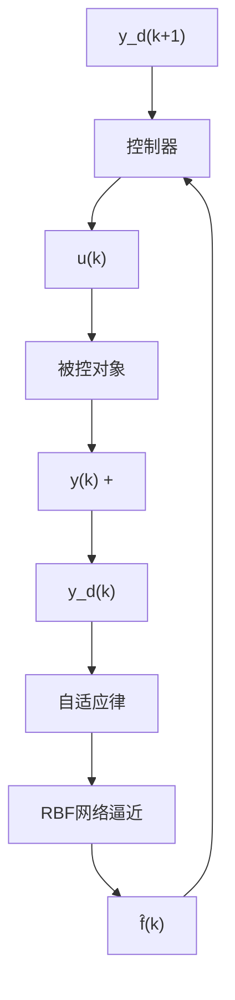

# 9.11.3 自适应神经网络控制器设计

如果 $f(x(k))$ 是未知的, 可用 RBF 神经网络逼近 $f(x(k))$ 。神经网络的输出为

$$\hat {f} (\boldsymbol {x} (k)) = \hat {\boldsymbol {w}} (k) ^ {\mathrm{T}} \boldsymbol {h} (\boldsymbol {x} (k)) \tag {9.80}$$

式中， $w(k)$ 为神经网络输出权值向量， $h(x(k))$ 为高斯基函数。

根据 RBF 网络逼近定理, 对于任意小的非零逼近误差 $\varepsilon_{f}$ , 则存在某个最优权值向量 $w^{*}$ , 使

$$f (\boldsymbol {x}) = \widehat {f} (\boldsymbol {x}, \boldsymbol {w} ^ {*}) - \Delta_ {f} (\boldsymbol {x}) \tag {9.81}$$

式中， $\Delta_{f}(x)$ 为最优神经网络逼近误差， $|\Delta_{f}(x)|<\varepsilon_{f}$

则神经网络逼近误差为

$$
\begin{array}{l} \widetilde {f} (\boldsymbol {x} (k)) = f (\boldsymbol {x} (k)) - \widehat {f} (\boldsymbol {x} (k)) \\ = \hat {f} (\boldsymbol {x}, \boldsymbol {w} ^ {*}) - \Delta_ {f} (\boldsymbol {x} (k)) - \hat {\boldsymbol {w}} (k) ^ {\mathrm{T}} \boldsymbol {h} (\boldsymbol {x} (k)) \\ = - \widetilde {\boldsymbol {w}} (k) ^ {\mathrm{T}} \boldsymbol {h} (\boldsymbol {x} (k)) - \Delta_ {f} (\boldsymbol {x} (k)) \tag {9.82} \\ \end{array}
$$

式中， $\tilde{w}(k)=\hat{w}(k)-w^{*}$ 。

采用神经网络逼近未知函数,根据式(9.78),控制律可设计为

$$u (k) = y _ {\mathrm{d}} (k + 1) - \hat {f} (\boldsymbol {x} (k)) - c _ {1} e (k) \tag {9.83}$$

图 9-39 为基于神经网络逼近的自适应控制系统框图。

flowchart

图 9-39 基于神经网络逼近的自适应控制

将式 $(9.83)$ 代入式 $(9.77)$ ，可得

$$e (k + 1) = \widetilde {f} (\boldsymbol {x} (k)) - c _ {1} e (k)$$

则

$$e (k) + c _ {1} e (k - 1) = \widetilde {f} (\boldsymbol {x} (k - 1)) \tag {9.84}$$

式 $(9.84)$ 的另一种表达方式为

$$e (k) = \Gamma^ {- 1} (z ^ {- 1}) \widetilde {f} (\boldsymbol {x} (k - 1)) \tag {9.85}$$

式中， $\Gamma(z^{-1})=1+c_{1}z^{-1},z^{-1}$ 为离散时间延时因子。

参考文献[37],定义一个新的误差函数为

$$e _ {1} (k) = \beta (e (k) - \Gamma^ {- 1} (z ^ {- 1}) v (k)) \tag {9.86}$$

式中， $\beta>0$ 。

将式 $(9.85)$ 代入式 $(9.86)$ ，可得

$$e _ {1} (k) = \beta \Gamma^ {- 1} (z ^ {- 1}) (\widetilde {f} (\boldsymbol {x} (k - 1)) - v (k)) = \beta \frac {1}{1 + c _ {1} z ^ {- 1}} (\widetilde {f} (\boldsymbol {x} (k - 1)) - v (k))$$

整理可得

$$e _ {1} (k - 1) = \frac {\beta (\widetilde {f} (\pmb {x} (k - 1)) - v (k)) - e _ {1} (k)}{c _ {1}} \tag {9.87}$$

根据文献[37],设计自适应控制律为

$$
\Delta \hat {\boldsymbol {w}} (k) = \left\{ \begin{array}{l l} \frac {\beta}{\gamma c _ {1} ^ {2}} \boldsymbol {h} (\boldsymbol {x} (k - 1)) e _ {1} (k) & | e _ {1} (k) | > \varepsilon_ {f} / G \\ 0 & | e _ {1} (k) | \leqslant \varepsilon_ {f} / G \end{array} \right. \tag {9.88}
$$

式中， $\Delta\hat{w}(k)=\hat{w}(k)-\hat{w}(k-1)$ ， $\gamma$ 和 G 是严格的正常数。
