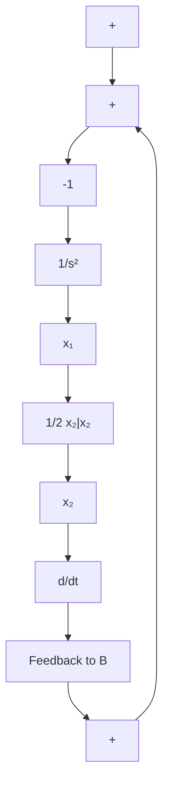

$$u ^ {*} \left(x _ {1}, x _ {2}\right) = + 1 \qquad \text {当} x \in \gamma_ {+} \text {及} x \in R _ {+} \tag {4-41}u ^ {*} \left(x _ {1}, x _ {2}\right) = - 1 \qquad \text {当} x \in \gamma_ {-} \text {及} x \in R _ {-} \tag {4-42}$$

根据上面的关系, $u^{*}$ 可以通过非线性的状态反馈来构成。

图4-5表示了重积分系统时间最优控制的工程实现。由图可见

$$Z = x _ {1} + \frac {1}{2} x _ {2} | x _ {2} |$$

flowchart

图4-5 重积分系统时间最优控制的框图

Z<0 时，u=1，即满足式(4-39)，Z>0 时，u=-1，即满足式(4-40)。图中的继电函数早期是用继电器实现的，由于继电器在动作时有砰砰声，故这种最优控制又称为“砰砰”控制。当然，现在可以用无接触的电子开关或微处理机来实现这种控制规律，既方便可靠，又无砰砰声了。

例4-2 积分环节和惯性环节串联系统的最短时间控制其传递函数为

$$\boldsymbol {W} (s) = \frac {\boldsymbol {Y} (s)}{\boldsymbol {U} (s)} = \frac {1}{s (s + a)} \tag {4-43}$$

其中 $a$ 为大于0的实数。由式(4-43)可得运动方程为

$$\ddot {y} + a \dot {y} = u \tag {4-44}$$

令 $x_{1}$ 和 $x_{2}$ 为状态变量，并有

$$x _ {1} = y, x _ {2} = \dot {y}$$

则可得状态方程为

$$\dot {x} _ {1} = x _ {2} \tag {4-45}\dot {x} _ {2} = - a x _ {2} + u$$

控制约束为 $|u(t)| \leqslant 1$ ，最优控制只能取 $\pm 1$ 。

(1) 对于 u = +1 情形, 状态方程为

$$
\begin{array}{l} \dot {x} _ {1} = x _ {2} \\ \dot {x} _ {2} = - a x _ {2} + 1 \\ \end{array}
$$

其状态轨线相迹为

$$x _ {1} = - \frac {x _ {2}}{a} - \frac {1}{a ^ {2}} \ln | 1 - a x _ {2} | + C \tag {4-46}$$

如图 4-6(a) 所示, 箭头为状态运动方向。它有一条渐近线 $x_{2} = \frac{1}{a}$ , 如图中虚线所示。在这簇曲线中, 只有 $\gamma_{+}$ 到达平衡位置 0。

$$\gamma_ {+}: x _ {1} = - \frac {x _ {2}}{a} - \frac {1}{a ^ {2}} \ln | 1 - a x _ {2} |, \quad x _ {2} \leqslant 0 \tag {4-47}$$

text_image

x₂
x₂=1/a
u=+1 O x₁
γ₊

(a) $u = 1$   

text_image

x₂
γ₋
u=-1
O
x₁
x₂=-\frac{1}{a}

(b) u=-1   
图4-6 $\frac{1}{s(s + a)}$ 系统的相轨迹

(2) 对于 u = -1 的情形, 状态方程为

$$\dot {x} _ {1} = x _ {2}\dot {x} _ {2} = - a x _ {2} - 1$$

其状态轨线相迹为

$$x _ {1} = - \frac {x _ {2}}{a} + \frac {1}{a ^ {2}} \ln | 1 + a x _ {2} | + C \tag {4-48}$$

如图4-6(b)所示，箭头为状态运动方向。它有一条渐近线 $x_{2} = -\frac{1}{a}$ ，如图中虚线所示。在这簇曲线中，只有 $\gamma_{-}$ 到达平衡位置0。

$$\gamma_ {-}: x _ {1} = - \frac {x _ {2}}{a} + \frac {1}{a ^ {2}} \ln | 1 + a x _ {2} |, \quad x _ {2} \geqslant 0 \tag {4-49}$$
