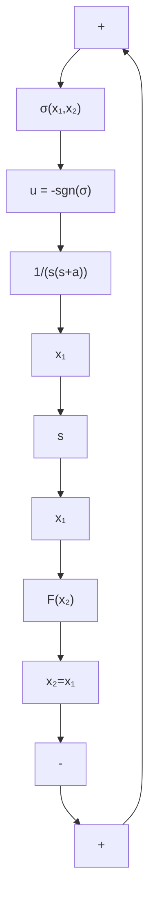

将 $\gamma_{+}$ 和 $\gamma_{-}$ 合并成一条曲线, 其方程为

$$\gamma : x _ {1} = - \frac {x _ {2}}{a} + \frac {1}{a ^ {2}} \mathrm{sgn} (x _ {2}) \ln | 1 + a | x _ {2} | | \tag {4-50}$$

令

$$F \left(x _ {2}\right) = - \frac {x _ {2}}{a} + \frac {1}{a ^ {2}} \operatorname{sgn} \left(x _ {2}\right) \ln | 1 + a | x _ {2} | | \tag {4-51}\sigma (x _ {1}, x _ {2}) = x _ {1} - F (x _ {2}) \tag {4-52}$$

于是曲线 $\gamma$ 方程可写为

$$\gamma : \sigma (x _ {1}, x _ {2}) = x _ {1} - F (x _ {2}) = 0 \tag {4-53}$$

曲线 $\gamma$ 将相平面分成两部分，如图4-7所示。 $\gamma$ 的上半平面包括 $\gamma_{-}$ 记为 $R_{-}, \gamma$ 的下半平面包括 $\gamma_{+}$ 记为 $R_{+}$ ，那么

$$R _ {+} = \left\{\left(x _ {1}, x _ {2}\right) \mid \sigma \left(x _ {1}, x _ {2}\right) < 0 \right\} \cup \gamma_ {+} \tag {4-54}R _ {-} = \left\{\left(x _ {1}, x _ {2}\right) \mid \sigma \left(x _ {1}, x _ {2}\right) > 0 \right\} \cup \gamma_ {-}$$

text_image

γ₋
b
O
A
R₋
x₁
x₂
R₊
B
a
γ₊

图4-7 $\frac{1}{s(s + a)}$ 系统的时间最优相轨迹和开关线

由于最优控制只取 $\pm 1$ ，它们的切换最多一次，根据状态初始位置不同，它们的最优控制是不同的，如图中初始状态在 $A$ 点时，它属于 $R_{-}$ ，所以开始 $u^{*} = -1$ 。当运动到达 $\gamma_{+}$ 时，与 $\gamma_{+}$ 交于 $a$ 点，马上切换为 $u^{*} = +1$ ，以后沿 $\gamma_{+}$ 运动直到平衡位置0，再除去控制量 $u^{*}$ 。当初始状态在 $B$ 点时，它属于 $R_{+}$ ，最优控制应先取 $u^{*} = +1$ ，到达 $\gamma_{-}$ 交于 $b$ 点时，马上切换为 $u^{*} = -1$ ，以后沿 $\gamma_{-}$ 继续运动，直到平衡位置0，切除控制量。

综上所述,最优控制的状态反馈规律为

$$
u ^ {*} \left(x _ {1}, x _ {2}\right) = \left\{ \begin{array}{l l} + 1 & \left(x _ {1}, x _ {2}\right) \in R _ {+} \\ - 1 & \left(x _ {1}, x _ {2}\right) \in R _ {-} \end{array} \right. \tag {4-55}
$$

最短时间最优控制的方框图如图 4-8 所示, 图中虚线部分是最短时间最优控制器。

flowchart

图4-8 $\frac{1}{s(s + a)}$ 系统的时间最优控制框图
