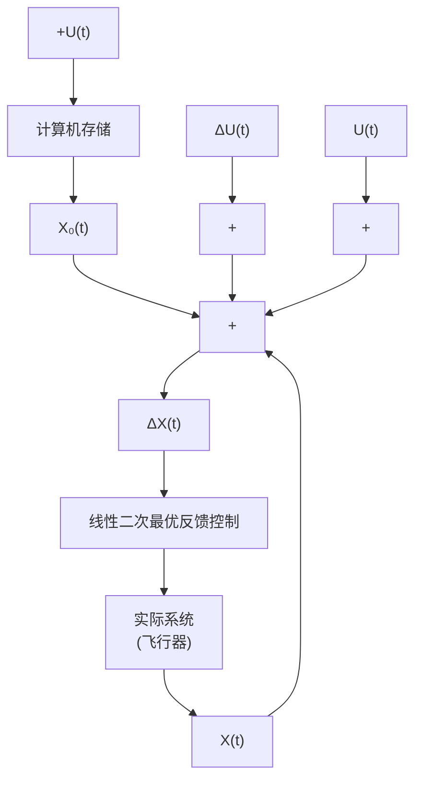

# 5.1 引言

用极小值原理解非线性系统的最优控制将导致非线性两点边值问题,这类问题求解是很困难的。即使系统是线性的,但当指标函数例如最短时间、最少燃料这种形式,要求得最优控制的解析表达式,并构成反馈控制(即把 $U(t)$ 表示为 $X(t)$ 的函数)也是非常困难的。下面将看到,若系统是线性的,指标函数是二次型的(指标函数是 $X(t)$ 和 $U(t)$ 的二次函数),则可以求得线性最优反馈控制律 $U(t) = -G(t)X(t)$ 。 $G(t)$ 的确定归结为求解一个非线性矩阵黎卡提(Riccati)微分方程或代数方程。而黎卡提方程的求解已研究得很透彻,有标准的计算机程序可应用,因此,求解既规范又方便。这种问题简称为线性二次型(Linear Quadratic 简称LQ)问题,目前应用得十分广泛,是现代控制理论最重要的结果之一。

线性二次型问题的实用意义还在于:把它所得到的最优反馈控制与非线性系统的开环最优控制结合起来,可减小开环控制的误差,达到更精确的控制的目的。例如,在飞行器的轨迹优化问题中,根据飞行器的状态方程(一般是非线性的)用极小值原理计算出名义的最优控制和最优状态轨迹,设分别用 $U_{0}(t)$ 和 $X_{0}(t)$ 表示。因为状态方程只能是对飞行器实际动力学特性的近似描绘,这里存在着模型误差,把 $U_{0}(t)$ 加到飞行器上去后,所产生的实际状态 $X(t)$ 将不同于 $X_{0}(t)$ (这里还未考虑作用在飞行器上的其他扰动作用)。令状态误差为 $\Delta X(t)=X(t)-X_{0}(t)$ ,要使 $\Delta X(t)$ 愈小愈好,为此,可根据 $\Delta X(t)$ 构成一个最优反馈控制 $\Delta U(t)$ ,作为校正信号加到 $U_{0}(t)$ 上去,得到的实际控制信号 $U(t)=U_{0}(t)+\Delta U(t)$ 将使飞行器尽可能沿着 $X_{0}(t)$ 飞行。由于 $\Delta X(t)$ 、 $\Delta U(t)$ 应该比较小,它们将满足线性的状态方程,所以可用线性二次型问题设计出反馈控制 $\Delta U(t)=-G(t)\Delta X(t)$ 。可用图5-1表示上面的思想。

在下面单独讨论线性二次型问题时,为使符号简洁,将用 X 和 U 分别代替 $\Delta X(t)$ 和 $\Delta U(t)$ 。

flowchart

图5-1 线性二次最优反馈控制的应用
