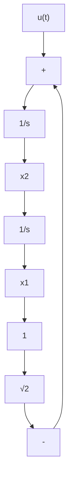

text_image

-k_{12}(0)\u03b1(t)\nt

(c)   
图5-3 $k_{12}(t), k_{22}(t), x_1(t), x_2(t)$ 和 $u(t)$ 的时间曲线

由图5-3可见，定常系统的反馈系数 $k_{12}(t), k_{22}(t)$ 都是时变的。当 $t_f$ 比系统的过渡过程时间大很多时， $k_{12}(t), k_{22}(t)$ 只在接近 $t_f$ 时才有较大的变化，其他时间接近于常数。当 $t_f \to \infty$ 时， $\dot{k}_{11}, \dot{k}_{12}, \dot{k}_{22}$ 都趋于0，则黎

卡提微分方程变为黎卡提代数方程

$$0 = - 1 + k _ {1 2} ^ {2}0 = - k _ {1 1} + k _ {1 2} k _ {2 2}0 = - 2 k _ {1 2} + k _ {2 2} ^ {2}$$

解上面的方程组,可得 $k_{11}$ 、 $k_{12}$ 、 $k_{22}$ 的稳态值

$$k _ {1 1} = \sqrt {2} \quad k _ {1 2} = 1 \quad k _ {2 2} = \sqrt {2}$$

于是最优控制律可表示为

$$u (t) = - x _ {1} (t) - \sqrt {2} x _ {2} (t) \tag {5-27}$$

最优控制系统的结构图如图 5-4 所示。

flowchart

图5-4 重积分系统最优控制的结构图
