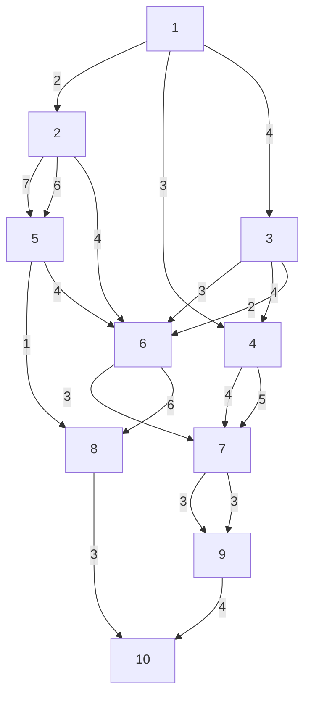

# 6.8 习题

1. 有十个城市①为起点，⑩为终点。站与站之间称为段，每段路程所用的时间（小时）写在段上，则应如何行驶，让从①到⑩所花的时间最短。

flowchart

图6-3 最短时间行驶问题

2. 一维线性系统, 设变量无约束, 最优控制问题的数学模型为:

$$J = \sum_ {k = 0} ^ {2} \left(q x _ {k} ^ {2} + r u _ {k} ^ {2}\right) Tx _ {k + 1} = a x _ {k} + b u _ {k}$$

初始状态 $x_{0}$ 为已知。式中 a、b、q，r 为常数，r > 0，设 T = 1 。求最优控制序列。

3.

$$J = \sum_ {k = 0} ^ {2} \left(x _ {k} ^ {2} + r u _ {k} ^ {2}\right) Tx _ {k + 1} = a x _ {k} + b u _ {k}, T = 1$$

求最优控制序列。

4. 运用动态规划方法确定下列系统的最优控制。

$$x (t _ {\bullet} + 1) = 2 x (t) + u (t)t = 0, 1, 2, 3J = \sum_ {t = 0} ^ {3} [ x ^ {2} (t) + u ^ {2} (t) ]$$

5. 系统方程为

$$\frac {\mathrm{d} x}{\mathrm{d} t} = - a x (t) + b u (t), \quad x \left(t _ {0}\right) = x _ {0}$$

求最优控制使

$$J = c x ^ {2} \left(t _ {1}\right) + \int_ {t _ {0}} ^ {t _ {1}} u ^ {2} \mathrm{d} t$$

取最小值,此处 a、b、c 均为正常数。

6. 对于系统 $\dot{x} = u$ ，最小化

$$J = \int_ {0} ^ {\mathrm{T}} \left[ u ^ {2} + x ^ {2} + \frac {x ^ {4}}{2} \right] \mathrm{d} t$$

写出哈密顿-雅可比-贝尔曼方程式。
