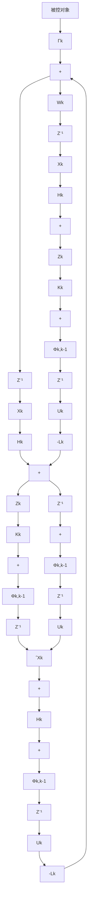

$$\boldsymbol {Q} _ {N} ^ {0} = \boldsymbol {Q} _ {N} = \boldsymbol {P} _ {N} \tag {8-57}$$

现在将上面LQG问题的结果(8-51)、(8-52)、(8-56)、(8-57)与确定性最优控制的结果式(8-13)、(8-10)、(8-11)和(8-12)分别对比，注意到LQG问题解中的 $Q_{K}^{0}$ 相当于确定性最优控制解中的 $\overline{K}_k$ ，于是两者解的形式完全相同，只是在LQG问题中用估计值 $\hat{X}_k$ 代替状态 $X_{k}$ 而已，于是分离定理得证。

利用分离定理的结论来设计线性随机系统的最优反馈控制器,框图如图8-1所示,图中 $Z^{-1}$ 表示一步延迟,反馈增益阵为

$$\boldsymbol {L} _ {k} = \boldsymbol {\Lambda} _ {k + 1} \boldsymbol {\Phi} _ {k + 1, k} \tag {8-58}$$

它和滤波增益阵 $K_{k}$ 都可预先离线计算出来。

flowchart

图8-1 线性随机系统的最优反馈控制框图
