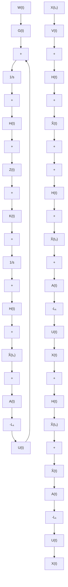
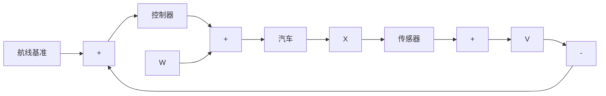

图8-2 连续随机线性系统最优控制的方块图

例 8-1 图 8-3 是汽车自动控制系统的示意图。汽车沿着道路上设置的制导电缆自动行驶，汽车偏移电缆的横向位移由传感器测出。图 8-4 是自动控制系统的原理方块图。图中 W 为作用在汽车上的干扰力（例如路面不平等引起），U 为方向舵控制力，V 为传感器测量噪声，X 为汽车侧向位移。

text_image

传感器
线圈
传感器
线圈
制导电缆

图8-3 汽车制导传感器原理图  

flowchart

图8-4 汽车制导方块图
