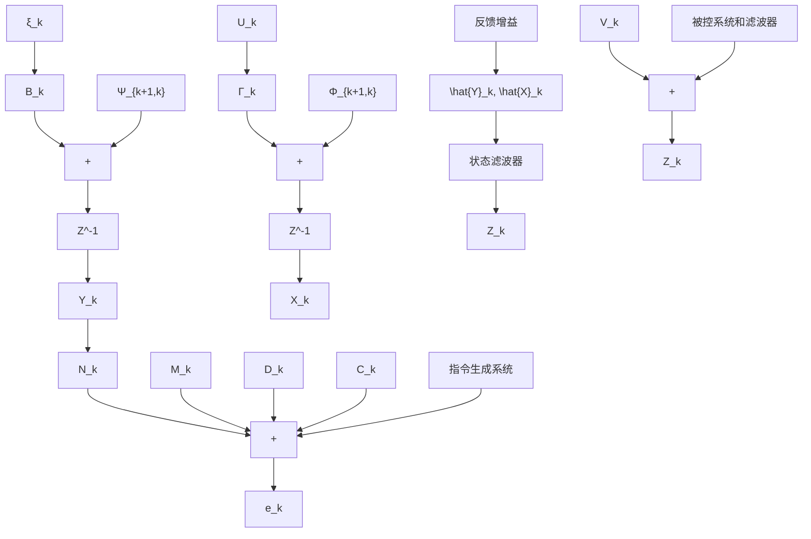

$$\boldsymbol {Z} _ {k} ^ {a} = \boldsymbol {H} _ {k} ^ {a} \boldsymbol {X} _ {k} ^ {a} + \boldsymbol {F} _ {k} ^ {a} \boldsymbol {V} _ {k} \tag {8-88}$$

其中

$$
\boldsymbol {Z} _ {k} ^ {a} = \left[ \begin{array}{l} \boldsymbol {Z} _ {k} \\ \boldsymbol {D} _ {k} \end{array} \right], \quad \boldsymbol {H} _ {k} ^ {a} = \left[ \begin{array}{c c} \boldsymbol {H} _ {k} & \boldsymbol {0} \\ \boldsymbol {0} & \boldsymbol {N} _ {k} \end{array} \right], \quad F _ {k} ^ {a} = \left[ \begin{array}{l} 1 \\ \boldsymbol {0} \end{array} \right]
$$

用这些增广向量和增广矩阵来表示指标函数,有

$$\boldsymbol {e} _ {k} = \boldsymbol {D} _ {k} - \boldsymbol {C} _ {k} = \boldsymbol {N} _ {k} \boldsymbol {Y} _ {k} - \boldsymbol {M} _ {k} \boldsymbol {X} _ {k} = [ - \boldsymbol {M} _ {k}, \boldsymbol {N} _ {k} ] \boldsymbol {X} _ {k} ^ {a}J = E \left\{\sum_ {k = 1} ^ {N} \left[ \left(\boldsymbol {X} _ {k} ^ {a}\right) ^ {\mathrm{T}} \left[ - \boldsymbol {M} _ {k}, \boldsymbol {N} _ {k} \right] ^ {\mathrm{T}} \overline {{\boldsymbol {Q}}} _ {k} \left[ - \boldsymbol {M} _ {k}, \boldsymbol {N} _ {k} \right] \boldsymbol {X} _ {k} ^ {a} + \boldsymbol {U} _ {k - 1} ^ {\mathrm{T}} \overline {{\boldsymbol {R}}} _ {k - 1} \boldsymbol {U} _ {k - 1} \right] \right\}$$

令

$$\boldsymbol {Q} _ {k} = \left[ - \boldsymbol {M} _ {k}, \boldsymbol {N} _ {k} \right] ^ {\mathrm{T}} \overline {{\boldsymbol {Q}}} _ {k} \left[ - \boldsymbol {M} _ {k}, \boldsymbol {N} _ {k} \right]$$

得

$$J = E \left\{\sum_ {k = 1} ^ {N} \left[ \left(\boldsymbol {X} _ {k} ^ {a}\right) ^ {\mathrm{T}} \boldsymbol {Q} _ {k} \boldsymbol {X} _ {k} ^ {a} + \boldsymbol {U} _ {k - 1} ^ {\mathrm{T}} \overline {{\boldsymbol {R}}} _ {k - 1} \boldsymbol {U} _ {k - 1} \right] \right\} \tag {8-89}$$

式(8-87)\~(8-89)组成了关于 $X_{k}^{a}$ 的LQG调节器问题。当 $M_{k}\equiv I$ ， $N_{k}\equiv0$ ，就化为关于 $X_{k}$ 的LQG调节器问题。

在设计这个增广系统的最优控制时,仍可采用分离定理的结论。不过这时的状态估计是对增广状态 $X_{k}^{a}$ 的估计,它是由 $\hat{X}_{k}$ 和 $\hat{Y}_{k}$ 组成的向量。将 $\hat{X}_{k}$ 和 $\hat{Y}_{k}$ 反馈即可构成最优跟踪控制系统,其结构图如图8-5所示。

flowchart

图8-5 随机线性跟踪器原理图
