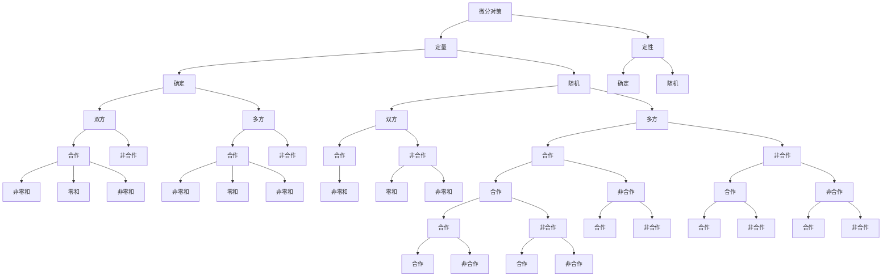

# 10.7 小结

1. 本章介绍了离散对策(又称矩阵对策)、连续对策和微分对策。本章介绍的都是零和对策, 即一方的赢得为另一方的支付。由于对策的双方都力图使自己赢得最大, 双方必然会从最坏的方案着手, 去争取最好的结果, 这也是一种稳妥的结果。若不论哪方先开局都存在

$$\max _ {v} \min _ {u} L _ {i j} = \min _ {u} \max _ {v} L _ {i j}$$

则称存在最优纯对策。当不存在纯对策时，可以将对策从不同的概率混合使用，得到最优混合策略解。

2. 连续对策问题的最优对策解满足所谓鞍点条件。给出了鞍点存

flowchart

图10-7 微分对策分类示意图

在的必要条件和充分条件。

3. 定量微分对策问题可化为一个极大值控制, 一个极小值控制问题。与单方极值控制不同的是哈密顿函数要满足对一方取极大对另一方取极小, 故称双方极值原理或极大极小(极小极大)原理。  
4. 线性二次型微分对策研究的是线性状态方程和二次型性能指标的对策问题,这时对策控制可写成状态的反馈形式,这点在实用中是很有意义的。  
5. 与动态规划中的最优性原理类似,微分对策也满足最优性原理,并可导出最优策略满足贝尔曼-依萨克斯方程。  
6. 微分对策的内容很丰富。它的简单分类框如图 10-7 所示。本章仅研究了其中的定量 - 确定性 - 双方 - 非合作 - 零和对策问题。
