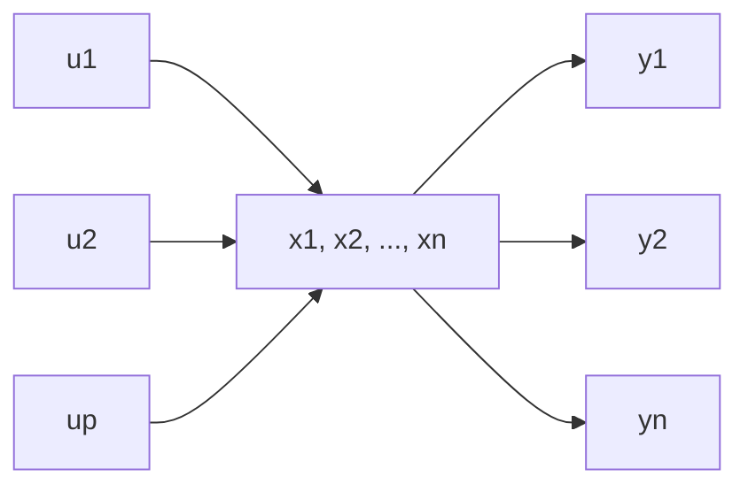

# 1.1 系统的状态空间描述

动态过程数学描述的两种基本类型 考察一个系统，它是由一些互相制约的部分构成的整体，可用图1.1的一个方块来表征。方块以外的部分为系统环境，环境对系统的作用为系统输入，系统对环境的作用为系统输出，两者分别用 $u_{1},\cdots,u_{p}$ 和 $y_{1},\cdots,y_{q}$ 来表示，它们被称为系统的外部变量。用以刻划系统在每个时刻所处状况的变量是系统的内部变量，用 $x_{1},\cdots,x_{n}$ 来表征，这些变量随着时间的变化体现了系统的行为。系统的数学描述就是反映系统变量间因果关系和变换关系的一种数学模型。

flowchart

图 1.1 系统的方块图表示

随着选取不同的变量组间的因果关系来表征系统的动态过程，系统数学描述常可区分为两种基本的类型。一是系统的外部描述，又称为输出-输入描述。这种描述的前提是把系统视为一个“黑箱”，不去表征系统的内部结构和内部变量，只是反映外部变量组间的因果关系即输出和输入间的因果关系。如果系统是线性的且其参数是定常的，并且只有一个输出变量和一个输入变量，那么其外部描述为如下形式的一个线性常系数微分方程：

$$
\begin{array}{l} y ^ {(n)} + a _ {n - 1} y ^ {(n - 1)} + \dots + a _ {1} y ^ {(1)} + a _ {0} y \\ = b _ {n - 1} u ^ {(n - 1)} + b _ {n - 2} u ^ {(n - 2)} + \dots + b _ {1} u ^ {(1)} + b _ {0} u \tag {1.1} \\ \end{array}
$$

其中， $y^{(i)}\triangleq d^{i}y/dt^{i}$ ， $u^{(i)}\triangleq d^{j}u/dt^{j}$ ， $a_{i}$ 和 $b_{j}$ 均为实常数， $i=0,1,\cdots,n,j=0,1,\cdots,n-1$ 。如果对上述方程取拉普拉斯变换，并假定系统具有零初始条件，则由此可得到系统的复频率域描述即传递函数

$$G (s) = \frac {b _ {n - 1} s ^ {n - 1} + \cdots + b _ {1} s + b _ {0}}{s ^ {n} + a _ {n - 1} s ^ {n - 1} + \cdots + a _ {1} s + a _ {0}} \tag {1.2}$$

系统的另一类型描述是内部描述，也即状态空间描述。内部描述是基于系统的内部结构分析的一类数学模型，它需要由两个数学方程来组成。一个是反映系统内部变量组 $(x_{1},\cdots,x_{n})$ 和输入变量组 $(u_{1},\cdots,u_{p})$ 间因果关系的数学表达式，常具有微分方程或差分方程的形式，称为状态方程。另一个是表征系统内部变量组 $(x_{1},\cdots,x_{n})$ 及输入变量组 $(u_{1},\cdots,u_{p})$ 和输出变量组 $(y_{1},\cdots,y_{q})$ 间转换关系的数学表达式，具有代数方程的形式，称为输出方程。

在以后的分析中将可看到,外部描述一般地说只是对系统的一种不完全的描述,它不能反映黑箱内部的某些部分。内部描述则是系统的一种完全的描述,它能完全表征系统的一切动力学特性。只是在系统满足一定属性的前提下,这两类描述之间才具有等价的关系。有关这方面的详细的讨论将在第三章中给出。

状态和状态空间 系统的状态空间描述是建立在状态和状态空间概念的基础上的。状态和状态空间本身，并不是一个新的概念，长期以来在质点和刚体动力学中得到了广泛的应用。但是，随着将它们引入到系统和控制理论中来，并使之适合于描述系统的动态过程，这两个概念才有了更为一般性的含义。

动力学系统的状态定义为完全地表征系统时间域行为的一个最小内部变量组。组成这个变量组的变量 $x_{1}(t), x_{2}(t), \cdots, x_{n}(t)$ 称为系统的状态变量，其中 $t \geqslant t_{0}, t_{0}$ 为初始时刻。由状态变量构成的列向量

$$
\boldsymbol {x} (t) = \left[ \begin{array}{c} x _ {1} (t) \\ \vdots \\ x _ {n} (t) \end{array} \right], \quad t \geqslant t _ {0} \tag {1.3}
$$
