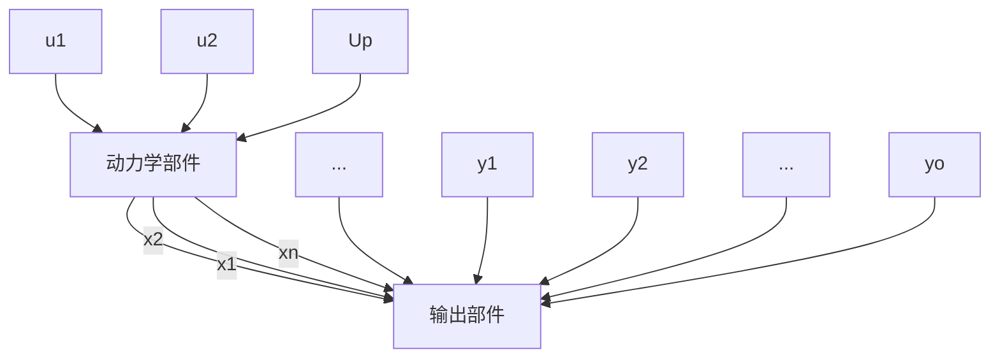

称为系统的状态向量，简称为状态。状态空间则定义为状态向量取值的一个向量空间。考虑到状态变量 $x_{1}(t)$ ， $x_{2}(t)$ ， $\cdots$ ， $x_{n}(t)$ 只能取为实数值，因此状态空间是建立在实数域上的向量空间，其维数即为 n。对于确定的某个时刻，状态表示为状态空间中的一个点；而状态随时间的变化过程，则构成了状态空间中的一条轨迹。

为了正确理解状态和状态空间的含义,有必要对其定义作如下几点解释: ① 状态变量组可完全地表征系统行为的属性体现在: 只要给定这组变量 $x_{1}(t), x_{2}(t), \cdots, x_{n}(t)$ 在初始时刻 $t_0$ 的值，以及输入变量 $u_1(t), u_2(t), \cdots, u_p(t)$ 在 $t \geqslant t_0$ 各瞬时的值，则系统中任何一个变量在 $t \geqslant t_0$ 时的运动行为也就随之完全地确定了。②状态变量组的最小性体现在：状态变量 $x_1(t), x_2(t), \cdots, x_n(t)$ 是为完全表征系统行为所必需的系统变量的最少个数，减少变量数将破坏表征的完全性，而增加变量数将是完全表征系统行为所不需要的。③状态变量组在数学上的特征体现在： $x_1(t), x_2(t), \cdots, x_n(t)$ 构成系统变量中线性无关的一个极大变量组。④状态变量组包含了系统的物理特征：当组成状态的变量个数 $n$ 为有穷正整数时，相应的系统为有穷维系统，且称 $n$ 为系统的阶次；当 $n$ 为无穷大时，相应的系统则是无穷维系统。一切集总参数系统都属于有穷维系统，而一切分布参数系统则属于无穷维系统。⑤状态变量组选取上的不唯一性：由于系统中变量的个数必大于 $n$ ，而其中仅有 $n$ 个是线性无关的，因此决定了状态变量组在选取上的不唯一性。⑥系统的任意选取的两个状态变量组之间为线性非奇异变换的关系：设 $x$ 和 $\bar{x}$ 为任意选取的两个状态向量：

$$
x = \left[ \begin{array}{c} x _ {1} \\ \vdots \\ x _ {n} \end{array} \right], \quad \bar {x} = \left[ \begin{array}{c} \bar {x} _ {1} \\ \vdots \\ \bar {x} _ {n} \end{array} \right] \tag {1.4}
$$

则据状态的定义可知， $\vec{x}_{1},\cdots,\vec{x}_{n}$ 为线性无关，因此可将 $x_{1},\cdots,x_{n}$ 的每一个变量表为 $\vec{x}_{1},\cdots,\vec{x}_{n}$ 的线性组合，且这种表示必是唯一的：

$$
\left\{ \begin{array}{l} x _ {1} = p _ {1 1} \bar {x} _ {1} + \dots + p _ {1 s} \bar {x} _ {s} \\ \dots \dots \\ x _ {s} = p _ {s 1} \bar {x} _ {1} + \dots + p _ {s s} \bar {x} _ {s} \end{array} \right. \tag {1.5}
$$

通过引入系数矩阵,则上式还可表为

$$\boldsymbol {x} = P \bar {\boldsymbol {x}} \tag {1.6}$$

其中

$$
P = \left[ \begin{array}{c c c} p _ {1 1} & \dots & p _ {1 n} \\ \vdots & & \vdots \\ p _ {n 1} & \dots & p _ {n n} \end{array} \right] \tag {1.7}
$$

同理，由于 $x_{1},\dots ,x_{n}$ 也为线性无关，因此又有

$$\bar {x} = Q x \tag {1.8}$$

从而由（1.6）和（1.8）可立即导出

$$P Q = Q P = I \tag {1.9}$$

表明 $P$ 和 $Q$ 互为逆，也即任意选取的两个状态 $\pmb{x}$ 和 $\pmb{x}$ 为线性非奇异变换关系。

动力学系统的状态空间描述 在引入了状态和状态空间概念的基础上，就可来建立动力学系统的状态空间描述。从结构的角度，一个动力学系统可用图1.2所示的方块图来表示，其中 $x_{1},\cdots,x_{n}$ 是表征系统行为的状态变量组， $u_{1},\cdots,u_{p}$ 和 $y_{1},\cdots,y_{q}$ 分别为系统的输入变量组和输出变量组。

flowchart

