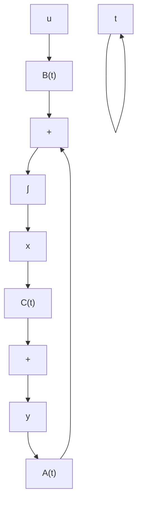
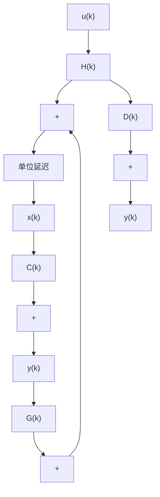

图1.4 线性系统的方块图

时变系统和时不变系统 当且仅当系统的状态空间描述中显含时间 t 时，即向量函数 f 和 g 或系数矩阵 A、B、C 和 D 是包含 t 的函数时，称相应的系统为时变系统。通常也称时变系统为非定常系统。时变系统的状态空间描述如 (1.19) 或 (1.20) 所示。

时不变系统又称为定常系统。时不变系统的特点是其状态空间描述中不显含时间 $t_{0}$ 。相对于线性系统和非线性系统，定常系统的状态空间描述的表达式为

$$
\left\{ \begin{array}{l} \dot {x} = A x + B u \\ y = C x + D u \end{array} \right. \tag {1.23}
$$

和

$$
\left\{ \begin{array}{l} \dot {x} = f (x, u) \\ y = g (x, u) \end{array} \right. \tag {1.24}
$$

定常系统在物理上代表了结构和参数都不随时间变化的一类系统。严格地说，由于内部和外部的影响不可能做到使系统的参数或结构完全不变，因此定常系统只是时变系统的一种理想化模型。但是，只要这种时变过程比之系统的运动过程足够地慢，则用定常系统代替时变系统进行分析仍可保证足够的精确度。由于时不变系统在分析和综合上的简单性，特别是（1.23）所示的线性时不变系统，将是我们在以下各章讨论中的重点。

连续系统和离散系统 连续系统的一个基本特点是,不管是作用于系统的变量,还是表征系统形态的变量,都是时间 $t$ 的连续变化过程。自然界和工程界中的绝大多数系统都是连续系统。连续系统的状态空间描述中,状态方程具有微分方程的形式,而输出方程为连续的变换方程。相对于各类系统,连续系统的状态空间描述分别如(1.19)、(1.20)、(1.23)和(1.24)所示。

当系统的各个变量只取值于离散的时刻时，相应的变量间的因果关系或变换关系，就必须采用离散时间系统来表征。离散时间系统简称为离散系统，它可以是一类实际的离散时间问题的数学模型，如许多社会经济问题、生态问题等，也可以是一个连续系统因为采用数字计算机进行计算或控制的需要而人为地加以时间离散化而导出的模型。离散系统的状态空间描述中，状态方程为差分方程，输出方程为离散时间变换方程。就线性系统而言，时变离散系统的状态空间描述为

$$
\left\{ \begin{array}{l} x (k + 1) = G (k) x (k) + H (k) u (k) \\ y (k) = C (k) x (k) + D (k) u (k) \end{array} \right. \tag {1.25}
$$

其中， $G(k)$ 、 $H(k)$ 、 $C(k)$ 和 $D(k)$ 为随 k 变化的时变矩阵，离散时刻 $k = 0, 1, 2, \cdots, l$ ，l 为某个正整数。相应地，由（1.25）所描述的线性时变离散系统的方块图如图 1.5 所示。进而，当系统为定常时，则线性定常离散系统的状态空间描述具有如下形式：

$$
\left\{ \begin{array}{l} x (k + 1) = G x (k) + H u (k), \quad k = 0, 1, 2, \dots \\ y (k) = C x (k) + D u (k) \end{array} \right. \tag {1.26}
$$

flowchart

图1.5 线性离散系统的方块图

确定性系统和随机系统 所谓确定性系统，是指系统的特性和参数是按确定的规律而变化的，且其各个输入变量(包括控制和扰动)也是按确定的规律而变化的。确定性系统的一个特点是，其状态和输出变量都为时间 $t$ 的确定性函数，通过分析可以确定这些变量在任一时刻的值。在随机系统中，不同于确定性系统，或者系统的特性和参数的变化不能用确定的规律来描述，或者作用于系统的变量(包括控制和扰动)是随机变量，或者两者兼而有之。随机系统的特点是，不能确定其状态和输出变量的直接时间过程，只能确定其统计的规律性。通常，对随机系统的分析远比确定性系统要复杂，只能采用概率统计和随机过程的理论与方法来加以处理。在本书中，我们将限于研究确定性系统的分析和综合，有关随机系统分析和综合的理论和方法可参阅随机控制或随机系统理论的教材或专著。
