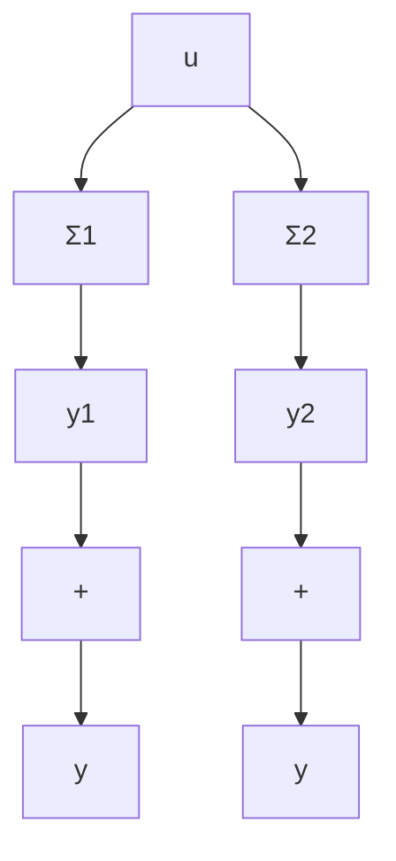

# 1.7 组合系统的状态空间描述

由两个或两个以上的子系统按一定方式联接构成的系统称为组合系统。组合的基本方式可分为串联、并联和反馈三种类型。一个比较复杂的实际系统，常常就是包含几种联接方式的一个组合系统。本节中，仅就上述三种基本组合方式，分别讨论相应的组合系统的状态空间描述。

flowchart

图1.6 子系统的并联

子系统的并联 考虑由两个子系统

$$\Sigma_ {i}: \quad \dot {x} _ {i} = A _ {i} x _ {i} + B _ {i} u _ {i} \quad (i = 1, 2) \tag {1.128}$$

经并联构成的组合系统 $\Sigma_{p}$ ，如图 1.6 所示。

不难看出,两个子系统可进行并联的条件为:

$$\dim \left(\boldsymbol {u} _ {1}\right) = \dim \left(\boldsymbol {u} _ {2}\right), \dim \left(\boldsymbol {y} _ {1}\right) = \dim \left(\boldsymbol {y} _ {2}\right) (1. 1 2 9)$$

式中符号 $\dim (\cdot)$ 表示向量（·）的维数。在实现了并联后系统在变量上的特点为：

$$\boldsymbol {u} _ {1} = \boldsymbol {u} _ {2} = \boldsymbol {u}, \quad \boldsymbol {y} _ {1} + \boldsymbol {y} _ {2} = \boldsymbol {y} \tag {1.130}$$

于是，对并联组合系统，由（1.128）和（1.130）可导出其动态方程为：

$$
\left\{ \begin{array}{l} \dot {x} _ {1} = A _ {1} x _ {1} + B _ {1} u \\ \dot {x} _ {2} = A _ {2} x _ {2} + B _ {2} u \\ y = C _ {1} x _ {1} + C _ {2} x _ {2} + (D _ {1} + D _ {2}) u \end{array} \right. \tag {1.131}
$$

表 $[x_1^T, x_2^T]^T$ 为组合系统的状态，并将(1.131)加以改写，即得到并联组合系统 $\Sigma_P$ 的状态空间描述为：

$$
\Sigma_ {P}: \quad \left[ \begin{array}{l} \dot {\boldsymbol {x}} _ {1} \\ \dot {\boldsymbol {x}} _ {2} \end{array} \right] = \left[ \begin{array}{l l} A _ {1} & 0 \\ 0 & A _ {2} \end{array} \right] \left[ \begin{array}{l} \boldsymbol {x} _ {1} \\ \boldsymbol {x} _ {2} \end{array} \right] + \left[ \begin{array}{l} B _ {1} \\ B _ {2} \end{array} \right] \boldsymbol {u} \tag {1.132}

\boldsymbol {y} = \left[ \begin{array}{l l} C _ {1} & C _ {2} \end{array} \right] \left[ \begin{array}{l} x _ {1} \\ x _ {2} \end{array} \right] + \left[ D _ {1} + D _ {2} \right] \boldsymbol {u}
$$

现推广讨论由 $N$ 个子系统并联构成的组合系统，则通过与上述相类同的推导，可导出 $\Sigma_{p}$ 的状态空间描述的一般表达式为：

$$
\Sigma_ {i}: \quad \left[ \begin{array}{c} \dot {\boldsymbol {x}} _ {1} \\ \vdots \\ \dot {\boldsymbol {x}} _ {N} \end{array} \right] = \left[ \begin{array}{c c c} A _ {1} & & \\ & \ddots & \\ & & A _ {N} \end{array} \right] \left[ \begin{array}{c} \boldsymbol {x} _ {1} \\ \vdots \\ \boldsymbol {x} _ {N} \end{array} \right] + \left[ \begin{array}{c} B _ {1} \\ \vdots \\ B _ {N} \end{array} \right] \boldsymbol {u} \tag {1.133}
