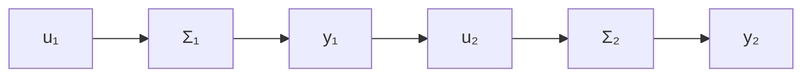

\boldsymbol {y} = \left[ C _ {1} \dots C _ {N} \right] \left[ \begin{array}{c} x _ {1} \\ \vdots \\ x _ {N} \end{array} \right] + [ D _ {1} + \dots + D _ {N} ] \boldsymbol {u}
$$

进一步，表子系统的传递函数矩阵为

$$G _ {i} (s) = C _ {i} \left(s I - A _ {i}\right) ^ {- 1} B _ {i} + D _ {i}, i = 1, \dots , N \tag {1.134}$$

那么，利用 $u_{1}=u_{2}=\cdots=u_{N}$ 和 $y=y_{1}+y_{2}+\cdots+y_{N}$ ，就可导出并联组合系统的传递函数矩阵为

$$G (s) = \sum_ {i = 1} ^ {N} G _ {i} (s) \tag {1.135}$$

子系统的串联 考虑图 1.7 所示的由两个子系统 $\Sigma_{1}$ 和 $\Sigma_{2}$ 经串联构成的组合系统，其中子系统的状态空间描述如 (1.128) 所示。

flowchart

图1.7 子系统的串联

两个子系统可以作串联联接的条件为：

$$\dim \left(\mathcal {Y} _ {1}\right) = \dim \left(\mathcal {U} _ {2}\right) \tag {1.136}$$

而在实现 $\Sigma_{1} - \Sigma_{2}$ 顺序的串联联接后组合系统在变量上的特点为：

$$u = u _ {1}, u _ {2} = y _ {1}, y _ {2} = y \tag {1.137}$$

由此，利用（1.128）和（1.137），可导出串联组合系统的状态空间描述为：

$$
\left\{ \begin{array}{l} \dot {x} _ {1} = A _ {1} x _ {1} + B _ {1} u \\ \dot {x} _ {2} = A _ {2} x _ {2} + B _ {2} C _ {1} x _ {1} + B _ {2} D _ {1} u \\ y = C _ {2} x _ {2} + D _ {2} C _ {1} x _ {1} + D _ {2} D _ {1} u \end{array} \right. \tag {1.138}
$$

或将其写成为标准化的形式就为：

$$
\begin{array}{l} \Sigma_ {T}: \quad \left[ \begin{array}{l} \dot {\boldsymbol {x}} _ {1} \\ \dot {\boldsymbol {x}} _ {2} \end{array} \right] = \left[ \begin{array}{l l} A _ {1} & 0 \\ B _ {2} C _ {1} & A _ {2} \end{array} \right] \left[ \begin{array}{l} \boldsymbol {x} _ {1} \\ \boldsymbol {x} _ {2} \end{array} \right] + \left[ \begin{array}{l} B _ {1} \\ B _ {2} D _ {1} \end{array} \right] \boldsymbol {u} \tag {1.139} \\ \boldsymbol {y} = \left[ D _ {2} C _ {1} \quad C _ {2} \right] \left[ \begin{array}{l} x _ {1} \\ x _ {2} \end{array} \right] + (D _ {1} D _ {2}) \boldsymbol {u} \\ \end{array}
$$

类似地，也可导出由N个子系统顺序串联构成的组合系统的状态空间描述，但其形式将相当复杂。

进而，利用

$$u _ {1} = u, u _ {2} = y _ {1}, \dots , u _ {N} = y _ {N - 1}, y _ {N} = y \tag {1.140}$$

又可导出串联组合系统的传递函数矩阵为：

$$G (s) = G _ {N} (s) G _ {N - 1} (s) \dots G _ {1} (s) \tag {1.141}$$

其中，子系统的传递函数矩阵 $G_{i}(s)$ 由式(1.134)所给出。

flowchart

