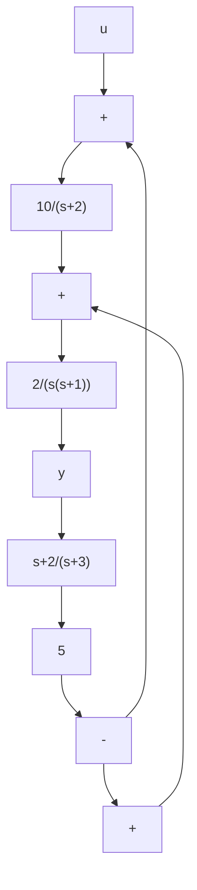

```mermaid
graph TD
    A["u+"] --> B["×"]
    B --> C["∫"]
    C --> D["ŷ"]
    D --> E["∫"]
    E --> F["y"]
    F --> G["×"]
    G --> H["+"]
    H --> I["×"]
    I --> J["+"]
    J --> K["a(t)"]
    K --> L["×"]
    L --> M["k"]
    M --> N["×"]
    N --> O["×"]
    O --> P["×"]
    P --> Q["×"]
    Q --> R["×"]
    R --> S["×"]
    S --> T["×"]
    T --> U["×"]
    U --> V["×"]
    V --> W["×"]
    W --> X["×"]
    X --> Y["×"]
    Y --> Z["×"]
    Z --> A
    style A fill:#f9f,stroke:#333
    style B fill:#ccf,stroke:#333
    style C fill:#cfc,stroke:#333
    style D fill:#fcc,stroke:#333
    style E fill:#cff,stroke:#333
    style F fill:#ffc,stroke:#333
    style G fill:#cfc,stroke:#333
    style H fill:#cfc,stroke:#333
    style I fill:#cfc,stroke:#333
    style J fill:#cfc,stroke:#333
    style K fill:#cfc,stroke:#333
    style L fill:#cfc,stroke:#333
    style M fill:#cfc,stroke:#333
    style N fill:#cfc,stroke:#333
    style O fill:#cfc,stroke:#333
    style P fill:#cfc,stroke:#333
    style Q fill:#cfc,stroke:#333
    style R fill:#cfc,stroke:#333
    style S fill:#cfc,stroke:#333
    style T fill:#cfc,stroke:#333
    style U fill:#cfc,stroke:#333
    style V fill:#cfc,stroke:#333
```

图 P1.4

1.4 图 P1.4 所示为某系统的方块图, 其中 u 和 y 分别为输入变量和输出变量。现规定状态变量为 $x_{1}=y$ 和 $x_{2}=y$ ，列写出系统的状态方程和输出方程。

1.5 求出下列各输入一输出描述的一个状态空间描述：

(i) $\ddot{y} + 2\dot{y} + 6\dot{y} + 3y = 5u$

(ii) $y + 2y + 6y + 3y = 7\dot{u} + 5u$

(iii) $3\dot{y} + 6\dot{y} + 12\dot{y} + 9y = 6\dot{u} + 3u$

1.6 求出下列各输入-输出描述的一个状态空间描述:

(i) $\frac{\hat{y}(s)}{\hat{u}(s)} = \frac{2s^2 + 18s + 40}{s^4 + 6s^2 + 11s + 6}$

(ii) $\frac{\hat{y}(s)}{\hat{u}(s)} = \frac{3(s + 5)}{(s + 3)^2(s + 1)}$

1.7 图 P1.5 为某系统的方块图, 其中 y 和 u 分别为其输出变量和输入变量, 求出它的一个状态空间描述。

flowchart

图 P1.5

1.8 求出下列方阵 $A$ 的特征方程和特征值：

(i) $A = \begin{bmatrix} 2 & 5 \\ -2 & -3 \end{bmatrix}$

(ii) $A = \begin{bmatrix} 0 & 1 & 0 \\ 0 & 0 & 1 \\ 0 & -1 & -1 \end{bmatrix}$

1.9 设 A 和 B 为同维的非奇异方阵，证明 AB 的特征值必等同于 BA 的特征值。

1.10 设 A 为 n 维非奇异常阵，且其特征值 $\{\lambda_{1}, \lambda_{2}, \cdots, \lambda_{n}\}$ 为两两相异，证明 $A^{-1}$ 的特征值为 $\{\lambda_{1}^{-1}, \lambda_{2}^{-1}, \cdots, \lambda_{n}^{-1}\}$ 。

1.11 化下列各状态方程为对角线规范形或约当规范形：
